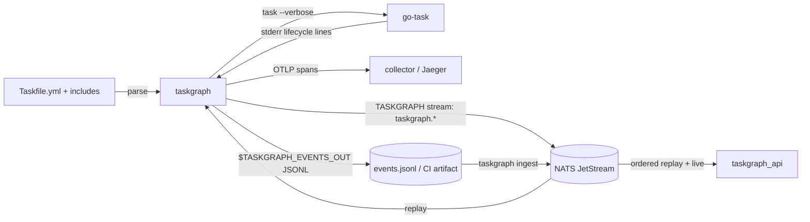

# taskgraph (CLI)

Drill into a go-task `Taskfile.yml` — tasks, dependencies both ways, history,
estimates — and run tasks through the real `task` binary while publishing every
execution fact to NATS JetStream and OTLP traces.



## Commands

| Command | What it does | Needs NATS |
|---|---|---|
| `taskgraph list [--all]` | every task, deps/calls count, p50, runs | no (history if reachable) |
| `taskgraph graph [TASK] [--depth N] [--format tree\|mermaid\|dot\|json]` | drill-down tree (entry points when no task) | no |
| `taskgraph show TASK [--json]` | definition, deps, calls, used-by, closure, history, estimate | no (history if reachable) |
| `taskgraph run TASK [-v] [--commands] [-- ARGS]` | run through go-task, publish events + spans, print the execution tree | optional |
| `taskgraph estimate TASK [--json]` | expected / pessimistic duration and critical path | yes |
| `taskgraph runs [RUN_ID_PREFIX] [--this] [--commands] [--json]` | recorded runs, or one run's execution tree | yes |
| `taskgraph publish` | publish the parsed graph only | yes |
| `taskgraph shim [ARGS…]` | drop-in for `task` (see [CI usage](#ci-usage-shim-events-file-ingest)) | optional |
| `taskgraph shell-scan [--out FILE] [--shellcheck BIN]` | ShellCheck every tracked script + Taskfile shell, write a `ShellScan` JSON | no |
| `taskgraph ingest FILE…` | publish recorded JSONL events to NATS (deduplicated by event id) | yes |

Global: `-t/--taskfile` (default: the file go-task would find from the current
directory), `--nats-url` (> `$NATS_URL` > `nats://localhost:4222`), `--offline`,
`--trace-url` (> `$TASKGRAPH_TRACE_URL`, e.g.
`http://localhost:16686/trace/{trace_id}`).

Environment: `TASKGRAPH_LOG` (log filter, default `warn`; `RUST_LOG` is ignored
on purpose — the repo `.env` sets it for services), `TASKGRAPH_TASK_BIN`
(go-task binary, default `task`), `OTEL_EXPORTER_OTLP_ENDPOINT` (enables span
export), plus:

| Env | Effect |
|---|---|
| `TASKGRAPH_OFFLINE` | truthy (set, not `""`/`0`/`false`) = `--offline`: never connect to NATS |
| `TASKGRAPH_EVENTS_OUT` | `run`/`shim` append every event as one JSON line to this file (parent dirs created), with or without NATS. Made absolute and passed on to nested `task` calls |
| `TASKGRAPH_CI_PROVIDER`, `_RUN_ID`, `_RUN_ATTEMPT`, `_RUN_URL`, `_PIPELINE`, `_JOB`, `_REPOSITORY`, `_REF`, `_SHA`, `_EVENT`, `_ACTOR` | override the detected CI context field by field; provider + run id alone mark a run as CI (Tekton) |
| `TASKGRAPH_SHIM_DEPTH` | set by the shim on every go-task it starts; above 16 the shim refuses (loop guard) |

## Run origin

Every `RunStarted` carries `origin`:

- `ci` — detected from GitHub Actions (`GITHUB_ACTIONS=true`: run id/attempt,
  run URL, workflow, job, repository, ref, sha, event, actor), GitLab CI,
  Buildkite, CircleCI and Jenkins; then the `TASKGRAPH_CI_*` overrides win
  field by field. A pull-request job should pass the PR head as
  `TASKGRAPH_CI_SHA` (`GITHUB_SHA` is the merge commit there).
- `invoker` — `agent` (a marker from `libs/core/authorship/agents.json` is
  set, e.g. `CLAUDECODE`; `agent` names it) > `ci` (a detected job, or a
  truthy `CI`) > `human`.
- `sha` — `git rev-parse HEAD` of the working directory, when it is a repo.

## CI usage: shim, events file, ingest

`taskgraph shim ARGS…` behaves like `task ARGS…`. One or more plain task names
(optionally `-- args` after a single name) run observed, in order, stopping at
the first non-zero exit and returning it. Anything else — a flag (`--list`,
`-t x.yml`), a `VAR=value`, no arguments, several names with `--`, a name not
in the parsed graph, no Taskfile — is `exec`'d to the real go-task with the
arguments unchanged. When `shim` is the first argument nothing after it is
parsed as a taskgraph flag (so `task --offline x` stays go-task's `--offline`);
configure the shim through the environment.

Install it as `task` early on `PATH` and point `TASKGRAPH_TASK_BIN` at the
real binary — otherwise `task` resolves back to the shim (the depth guard then
stops the loop with an error):

```sh
real_task=$(command -v task)
mkdir -p "$RUNNER_TEMP/shim"
printf '#!/bin/sh\nexec taskgraph shim "$@"\n' > "$RUNNER_TEMP/shim/task"
chmod +x "$RUNNER_TEMP/shim/task"
echo "$RUNNER_TEMP/shim" >> "$GITHUB_PATH"
echo "TASKGRAPH_TASK_BIN=$real_task" >> "$GITHUB_ENV"
echo "TASKGRAPH_OFFLINE=1" >> "$GITHUB_ENV"   # no NATS in GitHub-hosted CI: skip the 2 s connect per call
echo "TASKGRAPH_EVENTS_OUT=$RUNNER_TEMP/taskgraph/events.jsonl" >> "$GITHUB_ENV"
```

Upload the JSONL as an artifact; later, `taskgraph ingest events.jsonl`
publishes it to `TASKGRAPH` with `Nats-Msg-Id: <event_id>`, printing
`published / duplicates / malformed` per file (malformed lines are reported
with their line number and skipped; exit is non-zero only for unreadable files
or failed publishes). The server only deduplicates within the stream's
duplicate window (2 min default), so a re-ingest later must be prevented by
the caller.

## Shell scan

`taskgraph shell-scan` writes a `contract_taskgraph::shell::ShellScan`:

- sources: scripts `git ls-files` tracks under the root Taskfile's directory
  (`*.sh`, `*.bash`, or no extension with a `sh`/`bash` shebang; symlinks
  skipped) and every task's `cmds`/`status`/`preconditions` entry (a `defer:`
  command without its prefix). Paths are relative to the root Taskfile's
  directory; ids are `file:<path>` / `<kind>:<taskfile>:<task>:<index>`.
- Taskfile snippets have go-task templates (`{{…}}`) replaced by `__TPL__` and
  are linted as bash with SC2148 (no shebang), SC2154 (vars come from go-task
  `env:`/dotenv) and SC1091 (relative `source` unfollowable from a temp file)
  excluded. Finding positions refer to the neutralised snippet; a finding that
  touches a `__TPL__` is dropped (it is about text go-task renders — `for x in
  {{.LIST}}` "runs once" — not about the shell as written).
- `lines` = non-blank, non-comment lines; `branches` = whole-word
  `if`/`elif`/`case`/`for`/`while`/`until` plus `&&`/`||` (lexical: a keyword in
  a string counts, `case` counts once). `digest` = SHA-256 of the text as
  written.
- `sha` = `git rev-parse HEAD`, `ci` = the detected CI context, `tool` =
  `shellcheck <version>`. Findings never fail the command; a missing ShellCheck
  does, with an install hint.

## How `run` observes go-task

go-task stays the executor: templating, `status:`/`sources:`, `run: once`,
prompts and exit codes are its own, and stdin/stdout stay on the terminal.
`taskgraph` adds `--verbose`, reads go-task's stderr (`task: "x" started`,
`task: [x] cmd`, `task: "x" finished`, `Task "x" is up to date`, `"x" failed: …`),
hides the lines go-task only prints in verbose mode, and turns each transition
into an event and a span.

go-task runs a task once **per reference** and runs `deps` concurrently, so a
name is not an identity. Each start gets a run-scoped instance number; its
parent is the most recently started open execution whose `deps`/`cmds` reference
it (`dep` until that parent echoes a command, `call` after). A finish for a name
with several open executions is attributed to the oldest.

Exit code is go-task's (201 for a failed task). An unreachable NATS degrades to
a warning; the run itself never fails over telemetry.

## Estimates

Durations go-task reports are inclusive (a task starts before its deps and ends
after its last command), so estimates use **self time** — duration minus the
span its deps ran (including a `run: once` dep that executed elsewhere in the
run) and minus its `task:` calls — recombined with go-task's scheduling:

```text
total(t) = self(t) + max(total(d) for d in deps) + Σ total(c) for c in calls
```

Medians give `expected`, p90s give `pessimistic`; tasks with no history count
as 0 and are listed. History is per Taskfile per host (the graph id hashes both).

## Limits

- Remote (`https://…`) and templated (`{{.VAR}}`) includes are not resolved —
  they appear as unresolved includes with a warning; their tasks can still be
  run (go-task resolves them), they just have no static edges.
- With a remote include, `run` shows go-task's cache/download lines
  (`checking cache for …`, `downloading remote file: …`). `--verbose` makes
  go-task print them, and it prints them on **stdout**, which `run` leaves
  attached to the terminal so commands keep colours, progress bars and
  interactive prompts. Filtering them would mean capturing stdout.
- `for:` loops and templated task names in `deps`/`cmds` are unresolved edges.
- A `silent: true` task's commands are not echoed by go-task, so it has no
  command events.
