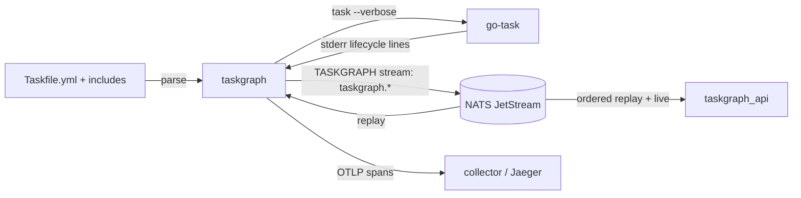

# taskgraph (CLI)

Drill into a go-task `Taskfile.yml` — tasks, dependencies both ways, history,
estimates — and run tasks through the real `task` binary while publishing every
execution fact to NATS JetStream and OTLP traces.



## Commands

| Command | What it does | Needs NATS |
|---|---|---|
| `taskgraph list [--all]` | every task, deps/calls count, p50, runs | no (history if reachable) |
| `taskgraph graph [TASK] [--depth N] [--format tree\|mermaid\|dot\|json]` | drill-down tree (entry points when no task) | no |
| `taskgraph show TASK [--json]` | definition, deps, calls, used-by, closure, history, estimate | no (history if reachable) |
| `taskgraph run TASK [-v] [--commands] [-- ARGS]` | run through go-task, publish events + spans, print the execution tree | optional |
| `taskgraph estimate TASK [--json]` | expected / pessimistic duration and critical path | yes |
| `taskgraph runs [RUN_ID_PREFIX] [--this] [--commands] [--json]` | recorded runs, or one run's execution tree | yes |
| `taskgraph publish` | publish the parsed graph only | yes |

Global: `-t/--taskfile` (default: the file go-task would find from the current
directory), `--nats-url` (> `$NATS_URL` > `nats://localhost:4222`), `--offline`,
`--trace-url` (> `$TASKGRAPH_TRACE_URL`, e.g.
`http://localhost:16686/trace/{trace_id}`).

Environment: `TASKGRAPH_LOG` (log filter, default `warn`; `RUST_LOG` is ignored
on purpose — the repo `.env` sets it for services), `TASKGRAPH_TASK_BIN`
(go-task binary, default `task`), `OTEL_EXPORTER_OTLP_ENDPOINT` (enables span
export).

## How `run` observes go-task

go-task stays the executor: templating, `status:`/`sources:`, `run: once`,
prompts and exit codes are its own, and stdin/stdout stay on the terminal.
`taskgraph` adds `--verbose`, reads go-task's stderr (`task: "x" started`,
`task: [x] cmd`, `task: "x" finished`, `Task "x" is up to date`, `"x" failed: …`),
hides the lines go-task only prints in verbose mode, and turns each transition
into an event and a span.

go-task runs a task once **per reference** and runs `deps` concurrently, so a
name is not an identity. Each start gets a run-scoped instance number; its
parent is the most recently started open execution whose `deps`/`cmds` reference
it (`dep` until that parent echoes a command, `call` after). A finish for a name
with several open executions is attributed to the oldest.

Exit code is go-task's (201 for a failed task). An unreachable NATS degrades to
a warning; the run itself never fails over telemetry.

## Estimates

Durations go-task reports are inclusive (a task starts before its deps and ends
after its last command), so estimates use **self time** — duration minus the
span its deps ran (including a `run: once` dep that executed elsewhere in the
run) and minus its `task:` calls — recombined with go-task's scheduling:

```text
total(t) = self(t) + max(total(d) for d in deps) + Σ total(c) for c in calls
```

Medians give `expected`, p90s give `pessimistic`; tasks with no history count
as 0 and are listed. History is per Taskfile per host (the graph id hashes both).

## Limits

- Remote (`https://…`) and templated (`{{.VAR}}`) includes are not resolved —
  they appear as unresolved includes with a warning; their tasks can still be
  run (go-task resolves them), they just have no static edges.
- With a remote include, `run` shows go-task's cache/download lines
  (`checking cache for …`, `downloading remote file: …`). `--verbose` makes
  go-task print them, and it prints them on **stdout**, which `run` leaves
  attached to the terminal so commands keep colours, progress bars and
  interactive prompts. Filtering them would mean capturing stdout.
- `for:` loops and templated task names in `deps`/`cmds` are unresolved edges.
- A `silent: true` task's commands are not echoed by go-task, so it has no
  command events.
