# PolicyHub — Design

Multi-tenant security policy management with a chat interface and an LLM agent.

This document is the primary deliverable. It describes the **production target architecture** of the system, then maps that target back to a small **MVP slice** we would build first. Scale and migration paths come at the end.

> Reading order. Sections 1–3 give the headline shape. Sections 4–14 describe the production architecture in detail. Section 15 onward is operational concerns, scale tiers, gaps, and trade-offs.

---

## 1. Scope: MVP vs production target

| | MVP slice | Production target |
|---|---|---|
| Components | `api` + `agent` (library) + `bot` — 3 processes | Splits to 5–7 services as scaling pain justifies (rationale in § 2.1) |
| Database | Postgres + RLS | Postgres (partitioned by tenant, read replicas) + pgvector |
| Auth | Per-tenant Argon2-hashed API key | Identity service issuing short-lived JWTs; mTLS between services |
| Sync | All synchronous HTTP | Redis Streams for async work (events, ingestion, notifications); NATS at higher tiers |
| Search | Postgres FTS (`tsvector`) | FTS + semantic (embeddings, ANN over pgvector) |
| Cache | None | Redis cluster (sessions, policies, rate-limit counters, idempotency) |
| Observability | `pino` structured logs, request id | OpenTelemetry traces, LangSmith for agent runs, Prometheus metrics, Loki logs, Sentry errors |
| Deployment | Two Node processes + docker-compose | Stateless services on Kubernetes, HPA, multi-AZ |
| Tenant context | API key → tenantId in `AsyncLocalStorage` | JWT claim → context; signed claims verified at gateway and API |

Everything in the MVP is a subset of the production design — same data model, same isolation invariants, same agent contract. The migration path (§ 18) is incremental, not a rewrite.

---

## 2. Production architecture

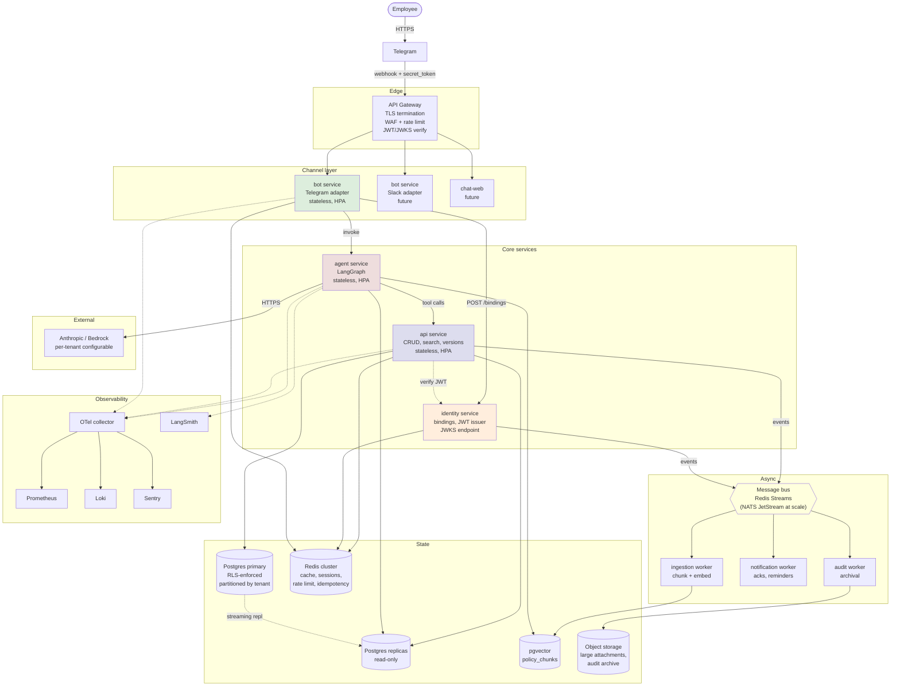

### 2.1 Why this many services?

Service count is operational cost, not a goal. Every service is its own deploy pipeline, dashboard, runbook, on-call escalation, scaling story, and network policy. The default should always be "fewer services" until a split buys you something concrete.

The production target lands at **5 services + 1–2 workers** (plus the gateway, which is usually a managed product, not code we ship). That number is the **endpoint** of an evolution that starts at 3 processes in the MVP. Each split fires only when a specific pain emerges.

| Service | Why it is its own thing | When this split actually fires |
|---|---|---|
| **bot** (per channel) | Different transport per channel (Telegram webhook ≠ Slack events ≠ web chat). Independent deploy/rollback per channel; one channel outage doesn't take siblings down. | Adding a second channel, or per-channel rate-limit incidents start affecting other channels. |
| **agent** | Reusable across all channels. Different scaling axis (LLM-bound). Independent deploy when prompts/tools change without restarting transport. Future: GPU-backed inference. | Adding a second channel, or prompt-change deploys start disrupting webhook handling. |
| **identity** | Holds the JWT signing key — the crown jewel. Smaller blast radius if breached. Auth-event audit kept separate from content-access audit. Higher availability SLO than `api`. | Auth event volume drowns out content audit, or security review demands the signing key be isolated. |
| **api** | Policy data plane. The bulk of request volume. | Always its own thing once we have a backend. |
| **ingestion worker** | Queue consumer, not HTTP. Different failure semantics (at-least-once, retries, DLQ). API restarts shouldn't drop in-flight embeddings. | Embedding work backs up during API peaks; cold-start latency on a big binary makes deploys painful. |
| **notification worker** | Same reasoning — async, idempotent, scale on queue depth not request rate. | Same triggers as ingestion. |
| **audit worker** | Streams cold partitions to object storage on cron. Could be a cron job; calling it a service is generous. | Audit log grows enough that hot-table size affects query plans. |

### 2.2 The collapse table — what you give up

The MVP we actually build first is the maximum sensible collapse: **3 processes** (`bot` + `agent`-as-library + `api`-with-identity-routes-and-background-tasks). It's enough through Tier 1. The table below is the "we could merge X into Y" check we run before adding any service:

| Collapse | What it saves | What it costs |
|---|---|---|
| `identity` → `api` | One service, one DB pool, simpler deploys | JWT signing key lives in main app process; auth audit mixed with content audit; coupled scaling decisions |
| All workers → `api` background tasks | No queue consumer to operate | API restart drops in-flight work; HTTP-tier scaling is coupled to queue-depth scaling |
| `agent` → `bot` | One less network hop, one less deploy | Can't reuse agent across channels; prompt changes redeploy the channel layer |
| Per-channel bots → one binary | Fewer deploys | A bug in Slack adapter takes down Telegram; per-channel scaling coupled |

The rule: **collapse until the cost column starts to bite, then split**. Don't pre-split for hypothetical futures.

### 2.3 Evolution path

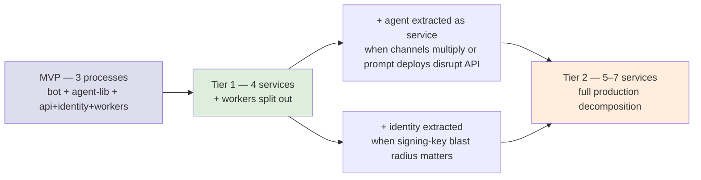

Each arrow is a deliberate response to a measured pain point, not a planned milestone.

### Component responsibilities

| Service | Purpose | State | Scales on |
|---|---|---|---|
| **API gateway** | TLS termination, WAF, edge rate limit, JWT signature check before forwarding | none | request volume |
| **bot** (per channel) | Adapter for Telegram / Slack / web chat. Verifies webhooks, dedupes updates, manages session JWT cache. | none (Redis-backed) | concurrent chats |
| **agent** | LangGraph state machine. Tools call API + vector store. Translates NL to tool calls and tool results to NL. | none | LLM call concurrency |
| **identity** | Owns `tenant`, `api_key`, `telegram_binding`, `user_role`. Issues short-lived JWTs. Exposes JWKS for verification. | DB + Redis | low — auth events |
| **api** | Owns `policy`, `policy_version`, `audit_log`. CRUD + keyword + semantic search. | DB | read volume |
| **ingestion worker** | Consumes `policy.*` events, chunks markdown, embeds, upserts into `policy_chunks`. | Redis Streams consumer group | policy write volume |
| **notification worker** | Consumes `ack.due`, `policy.published` events; sends Telegram reminders, admin notifications. | bus consumer | event volume |
| **audit worker** | Streams `audit_log` partitions older than the hot window to object storage. | bus + cron | data volume |

### Trust boundaries

| Boundary | Mechanism |
|---|---|
| Telegram → gateway | HTTPS + per-tenant `secret_token` set at webhook registration; gateway verifies before forwarding |
| Gateway → internal services | Mutual TLS via SPIFFE/SPIRE-issued workload certs (or a service mesh equivalent: Istio, Linkerd) |
| Bot → identity / agent / API | Service mTLS + caller forwards user `sessionJWT` (signed by identity) in `Authorization: Bearer` |
| API → DB | Postgres role with **no `BYPASSRLS`**. App role can read/write tenant data only under `SET LOCAL app.tenant_id` |
| Agent → LLM | HTTPS to provider; per-tenant API key in env or per-tenant Bedrock IAM role |
| Workers → MB | mTLS + consumer group ACLs |
| Anything → secrets | Cloud secret manager (GCP Secret Manager / AWS SM) with short-lived credentials via Workload Identity |

---

## 3. MVP architecture

What we actually build in ~3-4 hours, mapped to the production target.

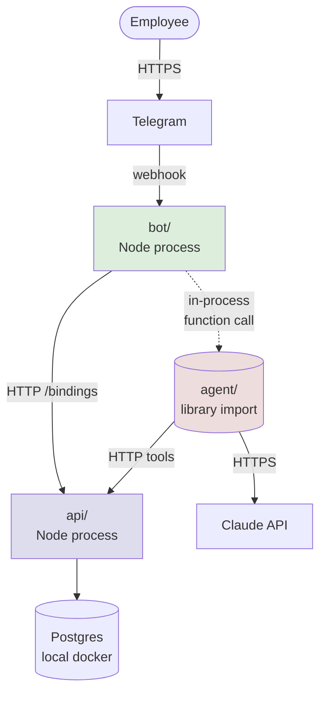

### MVP → production mapping

| MVP shape | Becomes in production |
|---|---|
| `agent/` as a library imported by `bot/` | Standalone `agent` service called over HTTP/gRPC |
| Per-tenant Argon2 API key | Short-lived JWT issued by `identity` service; API key reserved for service-to-service |
| Bot caches binding in-process LRU | Redis-backed session cache, shared across replicas |
| `api/` owns binding endpoint | Endpoint moves to `identity`; `api/` becomes data-plane only |
| No message bus — writes are sync end to end | NATS/Kafka; mutations publish events; cache invalidation, embedding, notifications go async |
| Postgres FTS only | + pgvector for semantic search |
| Pino structured logs only | OTel traces + Prometheus + Loki + LangSmith |
| Docker compose | Kubernetes + Helm + HPA + multi-AZ |

Every MVP component is a **forward-compatible subset**, not a throwaway scaffold. The repo layer, the agent contract, and the data model carry through unchanged.

---

## 4. Data flows

All flows are described against the production architecture. The MVP collapses some hops (e.g. bot → agent becomes a function call, identity merges into api).

### 4.1 First-time user binding

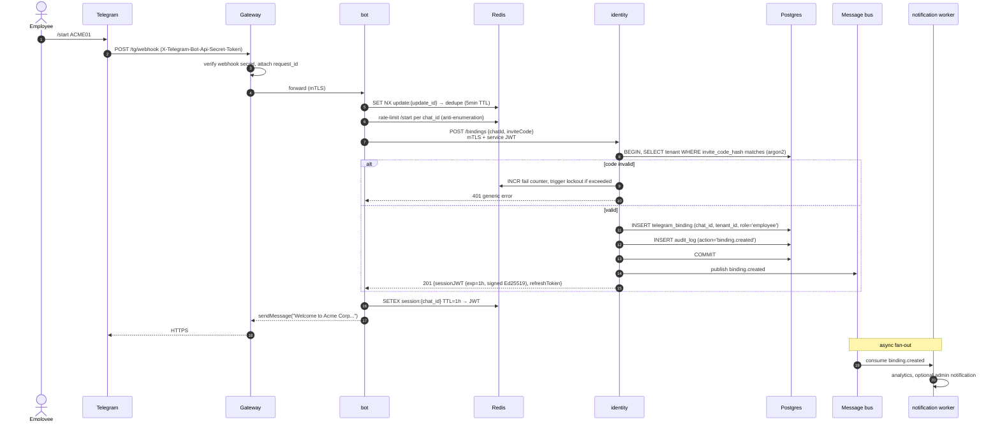

Key properties:

- The JWT is **short-lived (1h)** and never persisted. Bot stores it in Redis with matching TTL. On expiry, bot calls `POST /sessions/refresh` with the refresh token.
- The bot has no concept of the tenant's "long-term API key" — that's reserved for service identity in `identity`.
- Replay protection via Redis dedupe by `update_id`.
- Anti-enumeration via per-chat-id rate limit on `/start` failures.
- Invite code is **hashed at rest** (Argon2) — same posture as passwords. Knowing the DB row doesn't give you the code.
- `binding.created` event fans out async to analytics, welcome flows, etc., without making the user wait.

### 4.2 Natural-language question

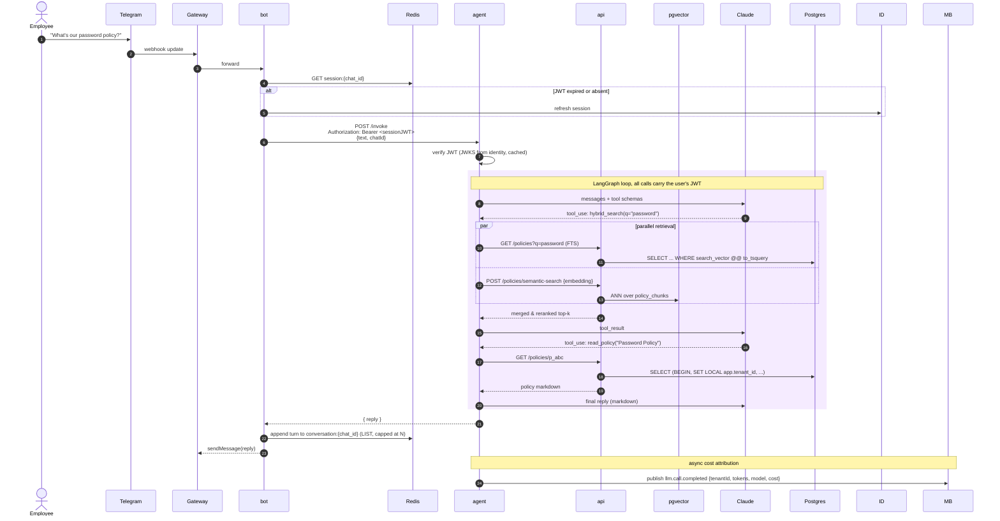

Production-relevant additions vs MVP:

- **JWT carries `tenantId` and `role` claims.** API does not authenticate against an API key per request; it verifies the JWT and extracts claims. JWKS is cached in API with TTL aligned to key rotation cadence.
- **Hybrid search.** FTS and semantic search run in parallel and results are reranked by a small reranker (BGE, Cohere, or LLM-based for the top 10). The agent's `hybrid_search` tool hides the choice.
- **Conversation memory** lives in Redis (`conversation:{chat_id}`), capped at N turns, fed back to the agent on each invocation. Older turns are summarized into a single "session note" by a cheap model.
- **Per-call cost attribution.** Each LLM call emits an event tagged with `tenantId, tokens, model, cost`. Aggregated daily for billing and per-tenant budget enforcement.

### 4.3 Policy update with versioning and async re-indexing

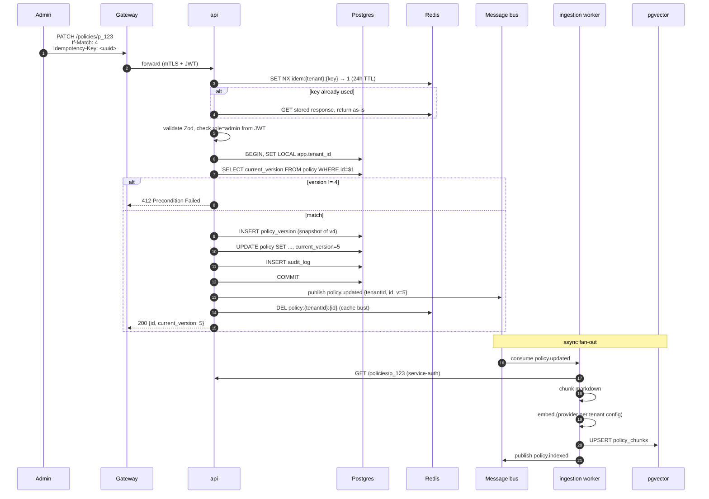

Production-relevant additions:

- **Idempotency**: `Idempotency-Key` deduped in Redis (24h window). Critical for retries from flaky clients.
- **Cache invalidation**: write path explicitly busts the read cache. Reads use `cache-aside`.
- **Re-indexing async**: chunking + embedding can take seconds for large policies. Don't make the admin wait.
- **Optimistic concurrency**: `If-Match` on version int → 412 if stale.

### 4.4 Background ingestion (new in production)

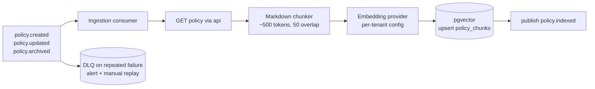

Ingestion is **at-least-once**. Chunk identity is deterministic (`hash(policyId + version + chunkIdx)`), so re-runs upsert without duplication. Failures after N retries → DLQ + alert.

---

## 5. Data model

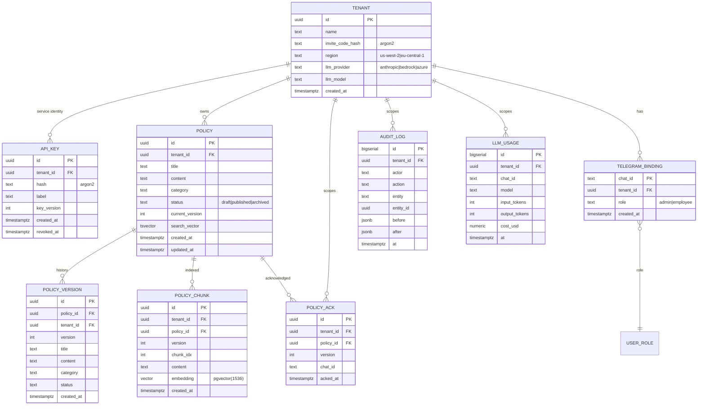

Schema notes:

- **`tenant_id` on every multi-tenant table**, denormalized where helpful (`policy_version`, `policy_chunk`, `audit_log`). RLS policies become uniform; hot indexes are always `(tenant_id, …)`.
- **`policy.search_vector`** is a generated `tsvector` column with a GIN index. Updated on `UPDATE` automatically.
- **`policy_chunk`** holds the semantic-search payload. HNSW index on `embedding` with `vector_cosine_ops`. Created by ingestion worker, never by API.
- **`api_key.key_version`** enables zero-downtime rotation. Multiple active keys allowed; revoked keys retained for audit.
- **`audit_log`** is append-only — DB grants exclude `UPDATE`/`DELETE` for the app role. Time-partitioned monthly.
- **`policy_ack`** is the stretch goal; modeled now so it integrates cleanly when built.
- **`llm_usage`** drives per-tenant cost attribution and budget enforcement.
- **`tenant.region`** anchors data residency at the tenant level (drives routing at the gateway).
- **`tenant.llm_provider` / `llm_model`** support enterprise BYO-LLM (Bedrock in a customer's VPC, Azure OpenAI for compliance).

### 5.1 Prisma schema

The Prisma schema is the source of truth for the relational shape. Vector and tsvector columns are declared as `Unsupported(...)` because Prisma cannot model them natively — they are read/written via raw SQL from the ingestion worker and search routes.

```prisma
generator client {
  provider        = "prisma-client-js"
  previewFeatures = ["postgresqlExtensions"]
}

datasource db {
  provider   = "postgresql"
  url        = env("DATABASE_URL")
  extensions = [pgcrypto, pg_trgm, vector(version: "0.7.0")]
}

model Tenant {
  id              String   @id @default(dbgenerated("gen_random_uuid()")) @db.Uuid
  name            String
  inviteCodeHash  String   @map("invite_code_hash")
  region          String   @default("us-west-2")
  llmProvider     String   @default("anthropic") @map("llm_provider")
  llmModel        String   @default("claude-sonnet-4-6") @map("llm_model")
  createdAt       DateTime @default(now()) @map("created_at") @db.Timestamptz(6)

  apiKeys   ApiKey[]
  policies  Policy[]
  bindings  TelegramBinding[]
  versions  PolicyVersion[]
  chunks    PolicyChunk[]
  acks      PolicyAck[]
  audits    AuditLog[]
  usage     LlmUsage[]

  @@map("tenant")
}

model ApiKey {
  id          String    @id @default(dbgenerated("gen_random_uuid()")) @db.Uuid
  tenantId    String    @map("tenant_id") @db.Uuid
  hash        String                                  // argon2
  label       String
  keyVersion  Int       @default(1) @map("key_version")
  createdAt   DateTime  @default(now()) @map("created_at") @db.Timestamptz(6)
  revokedAt   DateTime? @map("revoked_at") @db.Timestamptz(6)

  tenant      Tenant    @relation(fields: [tenantId], references: [id], onDelete: Cascade)

  @@map("api_key")
}

model TelegramBinding {
  chatId      String   @id @map("chat_id")
  tenantId    String   @map("tenant_id") @db.Uuid
  role        String   @default("employee")          // 'admin' | 'employee'
  createdAt   DateTime @default(now()) @map("created_at") @db.Timestamptz(6)

  tenant      Tenant   @relation(fields: [tenantId], references: [id], onDelete: Cascade)

  @@map("telegram_binding")
}

model Policy {
  id              String   @id @default(dbgenerated("gen_random_uuid()")) @db.Uuid
  tenantId        String   @map("tenant_id") @db.Uuid
  title           String
  content         String                              // markdown
  category        String
  status          String   @default("draft")          // 'draft' | 'published' | 'archived'
  currentVersion  Int      @default(1) @map("current_version")
  searchVector    Unsupported("tsvector")? @map("search_vector")
  createdAt       DateTime @default(now()) @map("created_at") @db.Timestamptz(6)
  updatedAt       DateTime @updatedAt @map("updated_at") @db.Timestamptz(6)

  tenant   Tenant          @relation(fields: [tenantId], references: [id], onDelete: Cascade)
  versions PolicyVersion[]
  chunks   PolicyChunk[]
  acks     PolicyAck[]

  @@map("policy")
}

model PolicyVersion {
  id          String   @id @default(dbgenerated("gen_random_uuid()")) @db.Uuid
  policyId    String   @map("policy_id") @db.Uuid
  tenantId    String   @map("tenant_id") @db.Uuid
  version     Int
  title       String
  content     String
  category    String
  status      String
  createdAt   DateTime @default(now()) @map("created_at") @db.Timestamptz(6)

  policy Policy @relation(fields: [policyId], references: [id], onDelete: Cascade)
  tenant Tenant @relation(fields: [tenantId], references: [id], onDelete: Cascade)

  @@unique([policyId, version])
  @@map("policy_version")
}

model PolicyChunk {
  id          String                       @id @default(dbgenerated("gen_random_uuid()")) @db.Uuid
  tenantId    String                       @map("tenant_id") @db.Uuid
  policyId    String                       @map("policy_id") @db.Uuid
  version     Int
  chunkIdx    Int                          @map("chunk_idx")
  content     String
  embedding   Unsupported("vector(1536)")
  createdAt   DateTime                     @default(now()) @map("created_at") @db.Timestamptz(6)

  policy Policy @relation(fields: [policyId], references: [id], onDelete: Cascade)
  tenant Tenant @relation(fields: [tenantId], references: [id], onDelete: Cascade)

  @@unique([policyId, version, chunkIdx])
  @@map("policy_chunk")
}

model PolicyAck {
  id          String   @id @default(dbgenerated("gen_random_uuid()")) @db.Uuid
  tenantId    String   @map("tenant_id") @db.Uuid
  policyId    String   @map("policy_id") @db.Uuid
  version     Int
  chatId      String   @map("chat_id")
  ackedAt     DateTime @default(now()) @map("acked_at") @db.Timestamptz(6)

  policy Policy @relation(fields: [policyId], references: [id], onDelete: Cascade)
  tenant Tenant @relation(fields: [tenantId], references: [id], onDelete: Cascade)

  @@unique([policyId, version, chatId])
  @@map("policy_ack")
}

model AuditLog {
  id        BigInt   @id @default(autoincrement())
  tenantId  String   @map("tenant_id") @db.Uuid
  actor     String                                   // chat_id or 'system'
  action    String                                   // 'policy.created' etc.
  entity    String                                   // 'policy' | 'binding' | …
  entityId  String?  @map("entity_id") @db.Uuid
  before    Json?
  after     Json?
  at        DateTime @default(now()) @db.Timestamptz(6)

  tenant Tenant @relation(fields: [tenantId], references: [id], onDelete: Cascade)

  @@map("audit_log")
}

model LlmUsage {
  id           BigInt   @id @default(autoincrement())
  tenantId     String   @map("tenant_id") @db.Uuid
  chatId       String?  @map("chat_id")
  model        String
  inputTokens  Int      @map("input_tokens")
  outputTokens Int      @map("output_tokens")
  costUsd      Decimal  @map("cost_usd") @db.Decimal(12, 6)
  at           DateTime @default(now()) @db.Timestamptz(6)

  tenant Tenant @relation(fields: [tenantId], references: [id], onDelete: Cascade)

  @@map("llm_usage")
}

model Outbox {
  id          BigInt    @id @default(autoincrement())
  tenantId    String    @map("tenant_id") @db.Uuid
  topic       String
  payload     Json
  createdAt   DateTime  @default(now()) @map("created_at") @db.Timestamptz(6)
  sentAt      DateTime? @map("sent_at") @db.Timestamptz(6)
  attempts    Int       @default(0)

  @@map("outbox")
}
```

### 5.2 Indexes

Indexes are declared in a hand-written SQL migration rather than via Prisma's `@@index` so we can use partial indexes, GIN, HNSW, and trigram operators that Prisma's DSL can't express.

```sql
-- tenant
CREATE UNIQUE INDEX tenant_invite_code_hash_uq  ON tenant(invite_code_hash);

-- api_key — partial index covers only active keys; verification still does argon2 on the row
CREATE INDEX api_key_tenant_active_idx          ON api_key(tenant_id) WHERE revoked_at IS NULL;

-- telegram_binding — PK on chat_id; secondary lookup by tenant_id
CREATE INDEX telegram_binding_tenant_idx        ON telegram_binding(tenant_id);

-- policy — every hot query starts with (tenant_id, ...)
CREATE INDEX policy_tenant_status_idx           ON policy(tenant_id, status);
CREATE INDEX policy_tenant_category_idx         ON policy(tenant_id, category);
CREATE INDEX policy_tenant_updated_idx          ON policy(tenant_id, updated_at DESC);
CREATE INDEX policy_search_gin_idx              ON policy USING gin (search_vector);
CREATE INDEX policy_title_trgm_idx              ON policy USING gin (title gin_trgm_ops);

-- policy_version — unique on (policy_id, version); tenant_id index for archival queries
CREATE INDEX policy_version_tenant_idx          ON policy_version(tenant_id);

-- policy_chunk — HNSW for ANN, tenant index for backfill
CREATE INDEX policy_chunk_tenant_idx            ON policy_chunk(tenant_id);
CREATE INDEX policy_chunk_embedding_hnsw_idx    ON policy_chunk
  USING hnsw (embedding vector_cosine_ops)
  WITH (m = 16, ef_construction = 64);

-- policy_ack — per-tenant time-ordered for admin dashboards
CREATE INDEX policy_ack_tenant_acked_idx        ON policy_ack(tenant_id, acked_at DESC);

-- audit_log — per-tenant time-ordered; also lookup by entity for forensic queries
CREATE INDEX audit_log_tenant_at_idx            ON audit_log(tenant_id, at DESC);
CREATE INDEX audit_log_entity_idx               ON audit_log(entity, entity_id);

-- llm_usage — per-tenant daily aggregation
CREATE INDEX llm_usage_tenant_at_idx            ON llm_usage(tenant_id, at DESC);

-- outbox — partial index covers only unsent rows
CREATE INDEX outbox_unsent_idx                  ON outbox(created_at) WHERE sent_at IS NULL;
```

**Index rationale**:

- Every multi-tenant table indexes `(tenant_id, …)` first. Combined with RLS, queries are both correct (RLS) and fast (index).
- Partial indexes on `api_key.revoked_at IS NULL` and `outbox.sent_at IS NULL` keep these indexes small even as historical rows accumulate.
- `policy.search_vector` GIN index supports FTS; trigram on `title` supports fuzzy title matching used by the `read_policy` agent tool.
- HNSW on `policy_chunk.embedding` is the ANN index for semantic search; tuned for recall (`ef_construction=64`) at the cost of build time.
- `policy_version` and `policy_chunk` use `@@unique` for natural keys; we don't need a separate non-unique index.

### 5.3 Triggers and generated columns

```sql
-- search_vector is updated automatically on INSERT and on UPDATE of relevant columns.
-- title weighted A (highest), category B, content C — drives ts_rank ordering.
CREATE OR REPLACE FUNCTION policy_search_vector_update()
RETURNS trigger LANGUAGE plpgsql AS $$
BEGIN
  NEW.search_vector :=
    setweight(to_tsvector('english', coalesce(NEW.title, '')),    'A') ||
    setweight(to_tsvector('english', coalesce(NEW.category, '')), 'B') ||
    setweight(to_tsvector('english', coalesce(NEW.content, '')),  'C');
  RETURN NEW;
END;
$$;

CREATE TRIGGER policy_search_vector_trg
  BEFORE INSERT OR UPDATE OF title, content, category ON policy
  FOR EACH ROW EXECUTE FUNCTION policy_search_vector_update();

-- updated_at: Prisma's @updatedAt only fires when the client updates; DB trigger is a backstop.
CREATE OR REPLACE FUNCTION set_updated_at()
RETURNS trigger LANGUAGE plpgsql AS $$
BEGIN
  NEW.updated_at := now();
  RETURN NEW;
END;
$$;

CREATE TRIGGER policy_updated_at_trg
  BEFORE UPDATE ON policy
  FOR EACH ROW EXECUTE FUNCTION set_updated_at();

-- audit_log and llm_usage are append-only. Trigger reinforces what the GRANT already enforces.
CREATE OR REPLACE FUNCTION raise_immutable()
RETURNS trigger LANGUAGE plpgsql AS $$
BEGIN
  RAISE EXCEPTION '% is append-only', TG_TABLE_NAME;
END;
$$;

CREATE TRIGGER audit_log_no_update BEFORE UPDATE ON audit_log
  FOR EACH ROW EXECUTE FUNCTION raise_immutable();
CREATE TRIGGER audit_log_no_delete BEFORE DELETE ON audit_log
  FOR EACH ROW EXECUTE FUNCTION raise_immutable();

CREATE TRIGGER llm_usage_no_update BEFORE UPDATE ON llm_usage
  FOR EACH ROW EXECUTE FUNCTION raise_immutable();
CREATE TRIGGER llm_usage_no_delete BEFORE DELETE ON llm_usage
  FOR EACH ROW EXECUTE FUNCTION raise_immutable();
```

### 5.4 Row-Level Security policies

This is the production tenant-isolation guarantee at the DB layer (Layer 6 in § 6). The app role does not have `BYPASSRLS`; every request must `SET LOCAL app.tenant_id` inside a transaction.

```sql
-- Dedicated role for the application; least-privilege grants.
CREATE ROLE app NOLOGIN;
GRANT CONNECT ON DATABASE policyhub TO app;
GRANT USAGE   ON SCHEMA public TO app;
GRANT USAGE   ON ALL SEQUENCES IN SCHEMA public TO app;

GRANT SELECT, INSERT, UPDATE         ON tenant             TO app;
GRANT SELECT, INSERT, UPDATE         ON api_key            TO app;
GRANT SELECT, INSERT, UPDATE, DELETE ON telegram_binding   TO app;
GRANT SELECT, INSERT, UPDATE         ON policy             TO app;
GRANT SELECT, INSERT                 ON policy_version     TO app;   -- versions are immutable
GRANT SELECT, INSERT, UPDATE, DELETE ON policy_chunk       TO app;   -- ingestion worker maintains
GRANT SELECT, INSERT                 ON policy_ack         TO app;
GRANT SELECT, INSERT                 ON audit_log          TO app;   -- append-only
GRANT SELECT, INSERT                 ON llm_usage          TO app;   -- append-only
GRANT SELECT, INSERT, UPDATE         ON outbox             TO app;

-- Session-variable convention: SET LOCAL app.tenant_id = '<uuid>' inside every txn.
CREATE OR REPLACE FUNCTION current_tenant_id() RETURNS uuid LANGUAGE sql STABLE AS $$
  SELECT NULLIF(current_setting('app.tenant_id', true), '')::uuid
$$;

-- Enable + FORCE RLS. FORCE makes RLS apply even to the table owner role.
ALTER TABLE tenant            ENABLE ROW LEVEL SECURITY;
ALTER TABLE tenant            FORCE  ROW LEVEL SECURITY;
ALTER TABLE api_key           ENABLE ROW LEVEL SECURITY;
ALTER TABLE api_key           FORCE  ROW LEVEL SECURITY;
ALTER TABLE telegram_binding  ENABLE ROW LEVEL SECURITY;
ALTER TABLE telegram_binding  FORCE  ROW LEVEL SECURITY;
ALTER TABLE policy            ENABLE ROW LEVEL SECURITY;
ALTER TABLE policy            FORCE  ROW LEVEL SECURITY;
ALTER TABLE policy_version    ENABLE ROW LEVEL SECURITY;
ALTER TABLE policy_version    FORCE  ROW LEVEL SECURITY;
ALTER TABLE policy_chunk      ENABLE ROW LEVEL SECURITY;
ALTER TABLE policy_chunk      FORCE  ROW LEVEL SECURITY;
ALTER TABLE policy_ack        ENABLE ROW LEVEL SECURITY;
ALTER TABLE policy_ack        FORCE  ROW LEVEL SECURITY;
ALTER TABLE audit_log         ENABLE ROW LEVEL SECURITY;
ALTER TABLE audit_log         FORCE  ROW LEVEL SECURITY;
ALTER TABLE llm_usage         ENABLE ROW LEVEL SECURITY;
ALTER TABLE llm_usage         FORCE  ROW LEVEL SECURITY;
ALTER TABLE outbox            ENABLE ROW LEVEL SECURITY;
ALTER TABLE outbox            FORCE  ROW LEVEL SECURITY;

-- One isolation policy per table. WITH CHECK guards writes (no tenant-spoofing on INSERT).
CREATE POLICY tenant_isolation ON tenant
  USING (id = current_tenant_id());

CREATE POLICY tenant_isolation ON api_key
  USING       (tenant_id = current_tenant_id())
  WITH CHECK  (tenant_id = current_tenant_id());

CREATE POLICY tenant_isolation ON telegram_binding
  USING       (tenant_id = current_tenant_id())
  WITH CHECK  (tenant_id = current_tenant_id());

CREATE POLICY tenant_isolation ON policy
  USING       (tenant_id = current_tenant_id())
  WITH CHECK  (tenant_id = current_tenant_id());

CREATE POLICY tenant_isolation ON policy_version
  USING       (tenant_id = current_tenant_id())
  WITH CHECK  (tenant_id = current_tenant_id());

CREATE POLICY tenant_isolation ON policy_chunk
  USING       (tenant_id = current_tenant_id())
  WITH CHECK  (tenant_id = current_tenant_id());

CREATE POLICY tenant_isolation ON policy_ack
  USING       (tenant_id = current_tenant_id())
  WITH CHECK  (tenant_id = current_tenant_id());

CREATE POLICY tenant_isolation ON audit_log
  USING       (tenant_id = current_tenant_id())
  WITH CHECK  (tenant_id = current_tenant_id());

CREATE POLICY tenant_isolation ON llm_usage
  USING       (tenant_id = current_tenant_id())
  WITH CHECK  (tenant_id = current_tenant_id());

CREATE POLICY tenant_isolation ON outbox
  USING       (tenant_id = current_tenant_id())
  WITH CHECK  (tenant_id = current_tenant_id());

-- Bootstrap path: the binding flow needs to find a tenant by invite-code hash
-- BEFORE a tenant context exists. Exposed as a SECURITY DEFINER function that runs
-- with elevated privileges but takes only a hash candidate and returns a single tenant id.
CREATE OR REPLACE FUNCTION lookup_tenant_by_invite_hash(p_hash text)
RETURNS uuid LANGUAGE sql SECURITY DEFINER SET search_path = public AS $$
  SELECT id FROM tenant WHERE invite_code_hash = p_hash LIMIT 1;
$$;
REVOKE EXECUTE ON FUNCTION lookup_tenant_by_invite_hash(text) FROM PUBLIC;
GRANT  EXECUTE ON FUNCTION lookup_tenant_by_invite_hash(text) TO app;
```

**Invariants enforced by RLS**:

- A query without `SET LOCAL app.tenant_id` returns zero rows (because `current_tenant_id()` returns NULL, which doesn't match any row).
- A query with a wrong `tenant_id` returns zero rows for that tenant's data.
- An INSERT with mismatched `tenant_id` fails the `WITH CHECK` clause.
- The DB owner role cannot bypass RLS because of `FORCE ROW LEVEL SECURITY`.

### 5.5 Constraint matrix

Constraints not visible from the Prisma schema:

| Table | Column / Rule | Constraint | Rationale |
|---|---|---|---|
| `policy` | `status` | `CHECK (status IN ('draft','published','archived'))` | enum without Postgres ENUM type; easier migration when adding values |
| `policy` | `current_version` | `CHECK (current_version >= 1)` | invariant |
| `telegram_binding` | `role` | `CHECK (role IN ('admin','employee'))` | enum |
| `api_key` | `(tenant_id, key_version)` | non-unique; multiple active versions during rotation | by design |
| `policy_version` | row-level | trigger forbids `UPDATE`/`DELETE` (and grant excludes them) | immutable history |
| `policy_chunk` | `embedding` | NOT NULL | a chunk without an embedding is useless |
| `audit_log`, `llm_usage` | row-level | grant excludes `UPDATE`/`DELETE`; triggers reinforce | append-only |
| all multi-tenant tables | `tenant_id` | NOT NULL + FK ON DELETE CASCADE | tenant deletion deletes all owned rows; RLS prevents cross-tenant inserts |

### 5.6 Migration ordering

Prisma's `prisma migrate` runs first to create base tables. Hand-written SQL migrations (numbered after Prisma's) layer on the parts Prisma cannot express. The order matters: triggers must come after columns, RLS must come after grants, indexes can come last.

```
prisma/migrations/
  20260520_000000_init/                    # Prisma-generated: tables, FKs, basic indexes
  20260520_010000_create_extensions/       # pgcrypto, pg_trgm, vector (postgres extensions)
  20260520_020000_search_vector_column/    # ALTER TABLE policy ADD COLUMN search_vector tsvector
  20260520_030000_search_vector_trigger/   # trigger function + trigger
  20260520_040000_immutability_triggers/   # audit_log, llm_usage, policy_version append-only
  20260520_050000_indexes/                 # GIN, HNSW, trigram, partial indexes
  20260520_060000_create_app_role/         # role + grants
  20260520_070000_enable_rls/              # ENABLE + FORCE RLS
  20260520_080000_rls_policies/            # CREATE POLICY tenant_isolation ON ...
  20260520_090000_security_definer_fns/    # lookup_tenant_by_invite_hash
  20260520_100000_check_constraints/       # status enums, version >= 1
  # tier 2 only:
  20270101_000000_partition_audit_log/     # convert to time-partitioned (online via pg_repack)
  20270101_010000_partition_policy/        # convert to hash-partitioned by tenant_id
```

A few gotchas worth calling out:

- The HNSW index should be created **after** the seed/initial data load — building HNSW is faster on populated tables than maintaining it during inserts.
- Enabling RLS on a non-empty table is safe but Prisma's introspection will see RLS-shadowed rows; do not run `prisma db pull` against a RLS-enforced DB as the app role.
- The CI pipeline runs migrations against a throwaway Postgres + asserts row counts + asserts that a cross-tenant query under RLS returns 0. This is part of the headline isolation test (§ 6).

### 5.7 Partitioning DDL (Tier 2)

At Tier 2 (§ 17), two tables dominate growth and warrant partitioning:

**`audit_log` — RANGE partition by `at` (monthly)**, for archival and pruning:

```sql
CREATE TABLE audit_log_p (LIKE audit_log INCLUDING ALL)
  PARTITION BY RANGE (at);

CREATE TABLE audit_log_2026_05 PARTITION OF audit_log_p
  FOR VALUES FROM ('2026-05-01') TO ('2026-06-01');
-- pg_partman creates future partitions automatically and detaches old ones
-- detached partitions are streamed to object storage by the audit worker.
```

**`policy` — HASH partition by `tenant_id`** (16 partitions, expandable):

```sql
CREATE TABLE policy_p (LIKE policy INCLUDING ALL)
  PARTITION BY HASH (tenant_id);
CREATE TABLE policy_p0  PARTITION OF policy_p FOR VALUES WITH (modulus 16, remainder 0);
-- ... policy_p1 .. policy_p15
```

Partitioning is transparent to the app because every query already filters on `tenant_id` (RLS guarantees this). The partition pruner picks the right partition automatically. RLS policies are inherited by child partitions.

The migration uses `pg_repack` or a logical replication cutover to avoid extended write downtime.

### 5.8 Sharding strategy at scale

At ~100k tenants, the single Postgres primary becomes the bottleneck. Two options, in order of preference:

1. **Postgres native partitioning on `tenant_id`** (above) — keeps Postgres semantics, transparent to app code, queries scope naturally. Works to maybe 10× the single-machine ceiling.
2. **Citus or pg_partman + logical shards** — distribute partitions across physical nodes. Co-locate `policy` and `policy_chunk` by `tenant_id` so JOINs stay local.

RLS policies survive partitioning unchanged. The session variable + policy approach works identically on partitioned and unpartitioned tables.

---

## 6. Multi-tenancy — six layers of defense

Tenant isolation is the most important property of this system. We use **defense in depth** — every layer assumes the previous might fail.

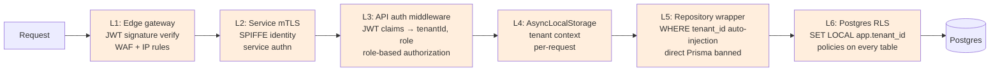

| Layer | What | Failure it catches |
|---|---|---|
| **L1 — Edge** | Gateway verifies JWT signature (cached JWKS from identity); WAF blocks known bad payloads; IP rate limit per tenant claim. | Unauthenticated traffic, forged tokens (signature mismatch), volumetric attacks. |
| **L2 — Service mTLS** | Every internal service authenticates the caller via SPIFFE-issued workload cert. No "anyone inside the VPC can call us" anti-pattern. | Lateral movement after a single-service compromise. |
| **L3 — App auth middleware** | API extracts `tenantId`, `role`, `chatId` claims; role-based authorization for admin endpoints. | Authenticated-but-unauthorized actions (employee trying to call admin endpoints). |
| **L4 — Context propagation** | `tenantId` lives in `AsyncLocalStorage`; no function in the call stack needs to pass it. | Developer forgetting to thread tenant through a new code path. |
| **L5 — Repository wrapper** | All DB access goes through `policyRepo`; reads tenant from ALS and injects into every query. Direct `prisma.policy.*` banned by lint rule + code review. | App code accidentally querying without a filter. |
| **L6 — Postgres RLS** | `SET LOCAL app.tenant_id` per request; every multi-tenant table has `ENABLE ROW LEVEL SECURITY` with `USING (tenant_id = current_setting('app.tenant_id')::uuid)`. App role does not have `BYPASSRLS`. | Bugs in L1-L5, ORM bypass, raw SQL gone wrong, malicious app-code change. |

### The headline test

`tenant-isolation.test.ts` proves the design end-to-end:

1. Create tenants `A` and `B` with seed policies.
2. Acquire a JWT for tenant `A`; list, search, get-by-id, version history — only `A`'s data appears.
3. Try `GET /policies/<idFromB>` with `A`'s JWT → **404, not 403** (we don't leak existence).
4. Forge a JWT with a different `tenantId` but the same signing key — accepted at L3. RLS at L6 still returns empty. Confirms layers are independent.
5. **Direct DB bypass attempt:** open a Postgres connection as the app role, manually `SET app.tenant_id = '<A>'`, then `SELECT * FROM policy WHERE tenant_id = '<B>'`. Returns zero rows. Proves RLS is the DB's enforcement, not the app's.

---

## 7. Identity, authentication, authorization

### Identities

| Subject | Identity | Issued by | Lifetime |
|---|---|---|---|
| End user (employee/admin) | `sessionJWT` (Ed25519) with claims `{tenantId, chatId, role, iss, aud, exp}` | identity service | 1h, refresh via refresh token |
| Service (bot, agent, ingestion, …) | x509 cert via SPIFFE/SPIRE workload identity | service mesh control plane | 1h, auto-rotated |
| Tenant (long-term service-to-service) | Argon2-hashed API key | identity service | until revoked |
| Telegram channel | Webhook `secret_token` per bot | configured at webhook setup | until rotated |

### JWT signing

- **Ed25519** keypair, rotated weekly.
- Private key in cloud secret manager; identity service is the **only** holder.
- Public keys exposed at `GET /.well-known/jwks.json` — verifiers (gateway, api, agent) cache with TTL.
- Multiple keys live during rotation; verifiers accept any non-expired key by `kid`.

### Authorization

RBAC, two roles: `admin` and `employee`. The `role` claim in the JWT decides which routes the bearer can hit. Captured on `telegram_binding.role` at bind time.

| Action | employee | admin |
|---|---|---|
| Search published policies | ✓ | ✓ |
| Read published policy | ✓ | ✓ |
| Read draft policy | ✗ | ✓ |
| Create / update policy | ✗ | ✓ |
| Archive policy | ✗ | ✓ |
| Read audit log | ✗ | ✓ |
| Invite admins | ✗ | ✓ |

Enforced in API middleware before the route handler runs.

### Refresh and revocation

- **Refresh tokens** are opaque (Redis-stored), per `(chatId, tokenId)`, 30-day TTL, single-use, rotating.
- **Revocation**: a denylist of `jti` values in Redis. Gateway and API consult on every request (sub-ms with pipelining). For mass revocation (compromised key), rotate the signing key and invalidate all JWTs older than the rotation timestamp.

---

## 8. Agent architecture

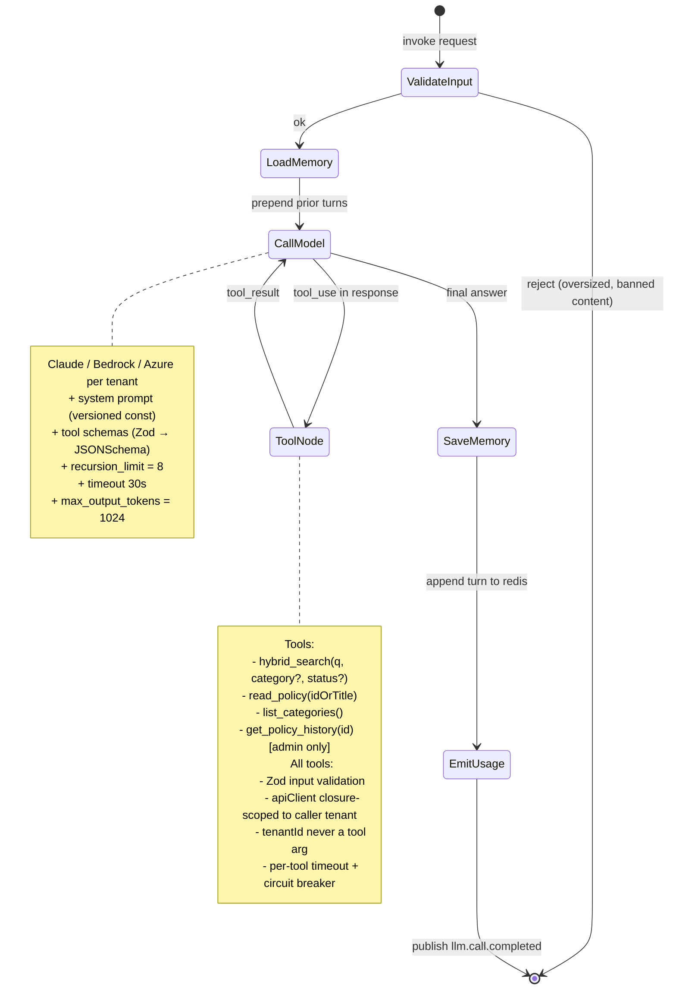

### Tools — security by construction

Tool signatures **do not accept a `tenantId`**. The `apiClient` they call is created by the agent service per invocation, carrying the user's JWT (whose `tenantId` claim is verified at the API). Even a jailbroken LLM cannot reach other tenants because:

1. Tool schemas have no `tenantId` field → Zod rejects.
2. The `apiClient` instance is bound to one tenant.
3. The API verifies the JWT independently.
4. RLS at the DB rejects anyway.

### Hybrid retrieval

The `hybrid_search` tool runs FTS and semantic search in parallel, fuses with reciprocal rank fusion (RRF), reranks the top 20 with a cross-encoder, and returns the top 5. Both queries respect tenant isolation through the standard chain.

### Conversation memory

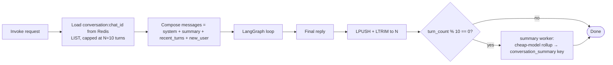

Recent turns verbatim; older turns collapsed into a single summary. Bounded token budget per invocation.

### Prompt injection posture

The agent's defenses do **not** rest on the system prompt. The prompt is a usability layer. Security is:

- Tools cannot reach other tenants (architecture, layers 3–6).
- LLM output is bounded (`max_output_tokens`).
- LLM cannot exfiltrate to arbitrary URLs (no `http_get` tool).
- Tool inputs are typed and validated; arbitrary code/sql is impossible.
- Policy content (which the LLM reads as tool output) is markdown; we render via Telegram MarkdownV2 with escaping. Even malicious policy markdown can't execute or call back.

---

## 9. Request lifecycle in the API

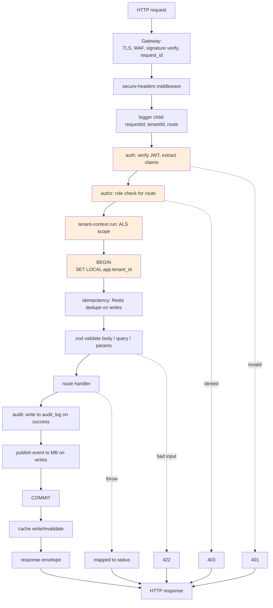

Error envelope is uniform:

```json
{ "error": { "code": "POLICY_NOT_FOUND", "message": "...", "requestId": "..." } }
```

Internal exception details never leak. Pino logs the full stack with `requestId`, `tenantId`, `route` so support can correlate from a user-reported request id.

---

## 10. Asynchronous architecture

### Event taxonomy

| Event | Producer | Consumers | Notes |
|---|---|---|---|
| `tenant.created` | identity | analytics, provisioning | one-time setup |
| `binding.created` | identity | notification, analytics | welcome flow |
| `auth.failed` | identity, api | security monitoring | flag spikes |
| `policy.created` / `policy.updated` / `policy.archived` | api | ingestion, cache-invalidator, notification | re-index, notify subscribers |
| `policy.indexed` | ingestion | (none — telemetry) | observability marker |
| `ack.recorded` | api | analytics, admin dashboard, compliance | for reporting |
| `llm.call.completed` | agent | billing aggregator, observability | tagged with `tenantId, tokens, cost` |

### Delivery semantics

- **At-least-once** for everything. Consumers are idempotent (chunk identity, ack natural keys, audit append-only).
- **Ordering by partition key = `tenant_id`**. Per-tenant ordering preserved; cross-tenant order doesn't matter.
- **DLQ** per consumer; alerts when DLQ depth > 0 for > 5 min.
- **Replay** by consumer group offset reset or DLQ drain.

### Choice: Redis Streams vs NATS JetStream vs Kafka

We already operate Redis (sessions, cache, rate limits, idempotency). Introducing a second messaging system has a real ops cost — extra dashboards, HA story, on-call surface — so the default should be "reuse Redis unless it falls short."

| | Redis Streams | NATS JetStream | Kafka |
|---|---|---|---|
| Already in stack | **Yes** | No | No |
| Ops complexity | Lowest (reuse Redis cluster) | Low | High |
| Throughput ceiling | ~1M msg/s on small cluster | ~M msg/s | 10M+ with proper hardware |
| Persistence | AOF / RDB; in-memory dataset | Disk-backed log | Disk-backed log, log-structured |
| Consumer groups | `XREADGROUP` + `XACK` | native | native |
| Replay | by stream id | by stream sequence | by offset |
| Cross-region | weaker | strong (geo-aware clustering) | strong (MirrorMaker) |
| Ecosystem | small | growing (KV, ObjectStore) | huge (Connect, Streams, Flink) |
| When to choose | < 100k sustained msg/s, want zero new infra | persistence-critical or cross-region needs | high-throughput streaming, rich ecosystem |

For PolicyHub Tier 1: **Redis Streams.** Event volume is dominated by policy mutations and LLM completions — both well under 10k/s even at Tier 2. Reusing Redis avoids introducing another HA story.

**Migration triggers** (move to NATS JetStream):

- Sustained > 100k msg/s, or memory pressure from retention requirements
- Cross-region replication becomes a hard requirement (Tier 3 multi-region)
- Need for stream replication with stronger durability guarantees than AOF gives us

**Migration to Kafka** only at Tier 3 if we need the ecosystem (Connect for warehouse export, Flink/Streams for stateful processing) or week+ retention.

Migration cost is bounded because every consumer is idempotent and we use a thin abstraction layer (`EventBus` interface) — swapping the broker is a config change for new deployments and a dual-write for in-flight migration.

### Outbox pattern for guaranteed delivery

Regardless of broker choice: writes inside a DB transaction also write to an `outbox` table; a separate drainer process publishes from outbox to the bus and marks rows sent. This decouples DB-commit from broker-availability — the broker can be down for hours without losing events.

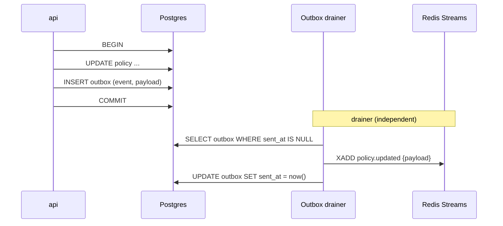

---

## 11. Caching strategy

| What | Where | TTL | Invalidation |
|---|---|---|---|
| Session JWTs | Redis (`session:{chatId}`) | aligned to exp | on logout / revoke |
| JWKS public keys | per-service in-process | 1h | hard refresh on `kid` miss |
| Tenant bindings (chatId → tenantId) | Redis | 1h | on rebind / revoke |
| Policy reads by id | Redis (`policy:{tenantId}:{id}`) | 5m | on `policy.updated` |
| Search results | not cached | — | freshness > hit rate |
| Idempotency keys | Redis (`idem:{tenantId}:{key}`) | 24h | natural expiry |
| Rate-limit counters | Redis (token bucket) | window | natural expiry |

Reads use cache-aside; writes invalidate explicitly. We do **not** cache cross-tenant data anywhere — every cache key starts with `{tenantId}` to make accidental cross-tenant cache hits impossible by construction.

---

## 12. Observability

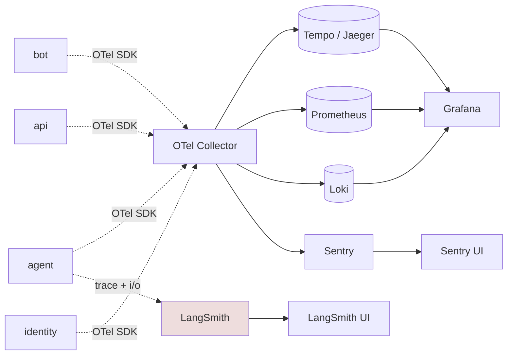

### What we instrument

- **Traces**: one trace per inbound message. `requestId` propagated as baggage end-to-end. Spans: webhook receive → bot → agent → api → DB.
- **Metrics** (Prometheus):
  - HTTP RED metrics per service, per route
  - Agent loop iterations, tool call counts, tool latencies
  - DB pool utilization, slow query rate
  - Cache hit/miss ratios
  - LLM tokens/sec, error rate
  - Queue depth per consumer
- **Logs** (Loki, via pino → otel-collector): structured JSON with `requestId, tenantId, chatId, route, latencyMs`.
- **Errors** (Sentry): unhandled exceptions, with redaction of `content` fields.
- **LangSmith**: every agent run with prompt, tool calls, final output. Drives prompt iteration.

### Cost attribution

Every `llm.call.completed` event includes `tenantId, model, input_tokens, output_tokens, cost_usd`. Aggregated into `llm_usage` table and rolled up daily. Feeds:

- Per-tenant cost dashboards (admins see their own usage)
- Budget enforcement (soft warn at 80%, hard cap at 100% — admin-configurable)
- Internal pricing / billing

---

## 13. Security beyond multi-tenancy

| Concern | Approach |
|---|---|
| Webhook hardening | Per-tenant `secret_token` + replay-protection via Redis dedupe on `update_id`; payload size limits; rate limit per IP. |
| Rate limiting | Three layers: gateway (per-IP), service (per-tenant), per-route (per-action). Token bucket in Redis. |
| Prompt injection | Architecture-enforced (§ 8). System prompt is hardening, not defense. |
| Secret management | Cloud secret manager + Workload Identity. No secrets in env files in production. |
| Audit logging | Append-only `audit_log`. Streams to object storage with monthly partitions. Tamper-evident via daily hash chain. |
| Input validation | Zod everywhere. Rejects malformed payloads before they reach the route handler. |
| Output encoding | All bot replies escaped per Telegram MarkdownV2 spec. No HTML/JS execution path. |
| Dependency hygiene | Renovate for updates, npm audit in CI, SBOM generation, supply-chain scanning (Snyk). |
| Penetration testing | Quarterly internal pen test focused on tenant boundaries; annual external assessment. |
| Data at rest | Postgres encryption at rest (cloud-native: KMS-backed); object storage SSE-KMS. |
| Data in transit | TLS 1.3 everywhere; mTLS internally. |

---

## 14. Reliability

This section answers the operational question: **what happens when a component fails, how do we detect it, and how do we recover?**

### 14.1 Deployment topology

- **Kubernetes** with multiple replicas of each stateless service spread across AZs; HPA on CPU + custom signals (queue depth, p95 latency).
- **PodDisruptionBudgets** keep at least N-1 replicas available during voluntary disruptions.
- **Postgres**: managed cloud Postgres (Cloud SQL / RDS) with synchronous replica in another AZ, async read replicas, automated daily backups + PITR.
- **Redis**: managed cluster with sentinel-coordinated failover; serves both cache/sessions and the message bus (Redis Streams).
- **Message bus**: Redis Streams in Tier 1; NATS JetStream 3-node cluster if migration triggers fire.

### 14.2 Failure-mode matrix

For every component, what breaks, what cushions the blow, and how we get back.

| Component down | User-facing impact | Auto-mitigation | Detection | Resolution (runbook) | RTO |
|---|---|---|---|---|---|
| **Edge gateway** | Total inbound outage | Multi-replica + AZ; managed LB health checks; provider failover | External synthetic uptime monitor (independent path) | Provider escalation; rollback recent gateway config | seconds (LB) → minutes (region) |
| **bot (Telegram)** | That channel can't receive/send; other channels intact | K8s HPA; **Telegram retries webhooks for ~24h** so messages aren't lost | Webhook 5xx rate; missed `update_id`; per-pod readyz | Restart/rollback; verify `secret_token`; check identity + agent + api dependencies | minutes; queued messages replay automatically |
| **agent** | Free-text questions fail; slash commands still work (they bypass the agent) | Circuit breaker in bot → templated reply ("I can't think right now, try `/search` or `/read`") | Agent error rate, LLM call failures, recursion-limit-hit rate | Investigate prompt / model / tool changes; rollback last deploy | minutes |
| **identity** | New logins + JWT refresh fail; **existing JWTs keep working until expiry (up to 1h)** because JWKS is cached at verifiers; Redis revocation denylist still works | Stateless verification at edge and API; cached JWKS | identity 5xx; JWT issuance latency; refresh failure rate | Restart; check DB + Redis dependencies; if signing key compromised → rotate JWKS, reissue | minutes |
| **api** | Agent tool calls fail; mutations fail; reads fail | Circuit breaker in agent → templated fallback; HPA | api 5xx; DB pool saturation; route latency | Investigate Postgres + downstream; rollback last deploy | minutes |
| **ingestion worker** | New/updated policies not in semantic index; **FTS still works**; agent's `hybrid_search` falls back to FTS-only | Outbox + stream retention; consumer resumes from last ack on restart | Stream consumer lag; DLQ depth | Restart; check embedding provider; replay from outbox if needed | hours — degraded mode, not an outage |
| **notification worker** | Ack reminders + admin notifications delayed | Stream retention; idempotent consumers | Stream consumer lag; DLQ depth | Restart; drain DLQ | hours — degraded, not an outage |
| **audit worker** | Archive to object storage falls behind; **audit_log in DB continues normally** | Worker is purely about offloading hot rows; no impact on live operations | Archival lag; partition size | Restart; expand partitions if lag is large | hours — no user impact |
| **Postgres primary** | Writes fail; reads can continue against the replica | Managed sync-replica failover; read traffic routes around primary | Connectivity loss; replication lag spike | Managed failover (typically automatic, 30-60s); if DR, promote replica manually | 30-60s (managed) → 1h (DR scenario) |
| **Postgres read replica** | Read load shifts to primary; latency increases | Multi-replica; route around the failed one | Replica lag/connectivity | Managed re-provision | minutes (mostly transparent) |
| **pgvector** | Semantic search unavailable | `hybrid_search` degrades to FTS-only; logged as degraded mode | Vector query latency; error rate | Restart; investigate index corruption | indefinite degraded mode — search recall drops but no outage |
| **Redis (cache + sessions)** | Cache misses → direct DB (latency up); session lookup degraded; rate limits unenforced; revocation denylist unavailable | JWT signature verification is **stateless and still works**; cache layer is performance, not correctness | Connectivity loss; cache hit-rate drop; rate-limit-bypass anomaly | Sentinel/cluster failover (seconds); warm cache by replay | seconds (sentinel) — fail-closed on revocation denylist is a security choice we make explicitly |
| **Redis Streams (bus)** | Events not delivered to consumers | **Outbox table holds events** in Postgres; drainer publishes on recovery; consumers resume from last ack | Outbox depth; drainer lag; stream lag | Sentinel failover; drain outbox on recovery | seconds-minutes; events are eventually consistent |
| **LLM provider** (Anthropic) | Free-text questions fail for tenants on that provider | Per-tenant provider failover (e.g., Anthropic → Bedrock); templated fallback if no alt | LLM call error rate; latency p99 | Flip tenant config to alternate provider; wait for restoration | minutes (failover) — hours (provider-side outage) |
| **Telegram** | No inbound or outbound through that channel; **we can't fix it** | None on our side; Telegram queues for redelivery once recovered | Outbound 5xx; webhook absence > N min | Wait; communicate on status page | provider-dependent |
| **Object storage** | Audit archive writes fail; attachment uploads fail | Archive write queued + retried; live audit_log unaffected | Write error rate | Wait/managed | minutes |
| **Secret manager** | New credential refreshes fail; **services with cached secrets continue running** | Secret caching with TTL; alert before TTL expiry when SM degraded | SM API errors during refresh | Managed/provider; refresh on recovery | minutes (running services unaffected until cache expires) |
| **Observability stack** | We are operating blind | User-facing services keep running; OTel exporter buffers/drops if overloaded | **Meta-monitoring** — a separate uptime check on the stack itself; absence-of-data alerts | Fix the stack; investigate retroactively from logs that buffered | not user-impacting |

### 14.3 Degradation levels

We classify the system's current health into discrete levels. Every page/alert references a level so on-call knows the blast radius at a glance.

| Level | State | What still works | What doesn't | Where we expect to be |
|---|---|---|---|---|
| **L0** | Healthy | Everything | — | 99.9% of the time |
| **L1** | Reduced | Full user-facing functionality; some background work delayed | Ingestion, notifications, archive, observability | Often during deploys and minor incidents |
| **L2** | Degraded | Slash commands; deterministic reads; admin operations | AI free-text answers; semantic search; (one channel may be offline) | LLM outages, agent bugs |
| **L3** | Read-only | Search, read, history | All writes (create/update/archive) | Postgres primary outage during failover |
| **L4** | Outage | — | User-facing requests fail | Rare; gateway/api/DB fully down |

Status page auto-publishes the level. Customer-tier SLAs reference these explicitly.

### 14.4 Cascading-failure prevention

The matrix above assumes failures stay scoped. Cascades are the real risk — one service's slow death dragging down its callers. We use four levers:

- **Circuit breakers on every service-to-service call.** Open after N failures in window W; cooldown C before half-open probe. Trips emit a metric; alert if breaker is open > 1 min. (libraries: `cockatiel`, `opossum`).
- **Hard HTTP timeouts** on every call (5s default; agent → LLM is 30s; admin endpoints can be longer). Slow > timeout = treat as failure, not as "still working."
- **Bounded DB connection pools** per service. Pool exhausted → return 503 immediately rather than queue requests behind a slow DB.
- **Bulkheads (per-tenant concurrency caps).** Agent invocations and LLM calls are capped per tenant. One tenant cannot starve the others.

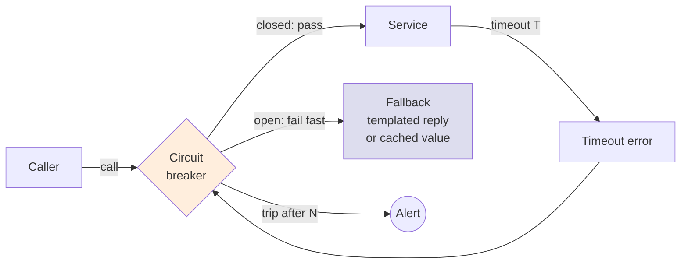

### 14.5 Detection — SLOs and alerts

We detect failures via SLOs, not just "is the service up." A service can be up and useless.

**Service Level Objectives** (per-tenant where applicable):

- API availability ≥ 99.9% (≈ 43 min/month error budget)
- API p95 latency < 300 ms (excluding deliberate long-running operations)
- Agent reply p95 < 4s end-to-end (excludes LLM tail beyond p99)
- Bus end-to-end (publish → consume + ack) p95 < 5s
- Outbox drain lag p95 < 10s

**Alert tiers**:

- **P1 / page**: SLO budget burn > 2% in 1h; total outage; security event; data integrity anomaly
- **P2 / ticket**: budget burn > 0.5% in 24h; degraded mode persists > 1h; DLQ depth > 0 for > 5 min
- **P3 / async**: anomaly detection; elevated queue depth that's still draining; cache hit-rate below floor

Each row in the matrix has a corresponding runbook page (Confluence/Notion). On-call follows the runbook; if it fails, escalate.

### 14.6 Incident response

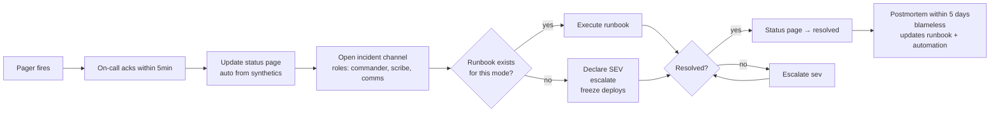

Postmortems are blameless and always produce concrete outputs: a runbook update, an alert tuning change, or an automation ticket. We track "did this incident happen before?" — repeat incidents indicate a missing automation, not bad luck.

### 14.7 Disaster recovery

- **Postgres**: PITR with WAL shipped to object storage (30-day retention); daily backups cross-region copied.
- **Redis**: AOF + RDB snapshots to object storage; rebuild from snapshot acceptable since most Redis content (cache, sessions) is regeneratable.
- **Object storage**: cross-region replication for audit archive (regulatory retention).
- **Quarterly DR drill**: spin up clean cluster, restore from backup, validate that RPO/RTO targets hold, exercise the runbook.
- **Game days**: planned chaos exercises (kill the agent, partition Redis, simulate LLM outage) to validate runbooks under realistic conditions, not just on paper.

**Targets**:

- **RPO** ≤ 5 minutes (sync replica + WAL shipping)
- **RTO** ≤ 1 hour (managed failover + service restart)
- **DR-tier RTO** ≤ 4 hours (full restore in another region)

### 14.8 Backpressure

- **Per-chat queue** (Redis stream per `chat_id`, concurrency 1) — one user can't flood the agent with parallel requests; their own messages are serialized.
- **Per-tenant LLM concurrency cap** — agent service tracks in-flight LLM calls per tenant; admission control beyond the cap.
- **Gateway admission control** — 429 with `Retry-After` when per-tenant rate exceeded; surfaced as a clear bot reply (not silent drop).

### 14.9 What this looks like end-to-end

The honest test of all this is a story. Suppose Anthropic has a partial outage at 02:13:

1. **02:13** — LLM error rate climbs from <1% to 30%.
2. **02:14** — Agent's per-call breaker on the Anthropic client trips for affected tenants after 3 consecutive failures.
3. **02:14** — Tenants configured with Bedrock as failover transparently switch; others get a templated "having trouble with the AI right now — try `/search` or `/read`".
4. **02:14** — Status page updates to L2 ("AI features degraded"). SLO burn alert fires (P1).
5. **02:15** — On-call pages. Runbook: confirm provider-side outage (Anthropic status page); decide whether to mass-flip tenants to Bedrock or wait.
6. **02:30** — If outage persists, flip per-tenant LLM provider config; agent picks up new config on next invocation.
7. **03:05** — Anthropic recovers. Breakers half-open, probe, close. Status returns to L0.
8. **+5 days** — Postmortem produces: alert tuning (breaker-trip alert wasn't paged), automation (auto-flip on N tenants experiencing breaker-open), and a runbook update.

At no point does the API die, Postgres die, or any user lose data. The system **degrades intentionally** and recovers.

---

## 15. What's built (MVP) vs designed (production target)

| Concern | MVP | Production |
|---|---|---|
| Postgres + RLS | Built | Same; partitioned at scale |
| Argon2-hashed API key | Built | Reserved for service identity; users get JWT |
| AsyncLocalStorage tenant context | Built | Same |
| Repository pattern, direct Prisma banned | Built | Same |
| Strict TS, Zod schemas, generated OpenAPI | Built | Same |
| Pino structured logging | Built | + OTel + Loki + Sentry |
| Uniform error envelope, requestId | Built | Same |
| `/healthz` + `/readyz`, graceful shutdown | Built | Same + readiness probes in K8s |
| Telegram webhook secret-token verification | Built | + edge replay protection + WAF |
| LangGraph agent + Zod tools + recursion limit | Built | Same + hybrid search + memory + cost emission |
| `If-Match` optimistic concurrency | Built | Same |
| Policy versioning | Built | Same |
| Append-only audit log | Built | Same + monthly partitions + object-storage archive |
| Dockerfile + docker-compose | Built | + K8s manifests/Helm + multi-AZ |
| GitHub Actions CI | Built | + image scanning + SBOM + signed deploys |
| Identity service / JWT issuance | Designed | Built |
| Service mTLS via SPIFFE | Designed | Built |
| Message bus + async workers | Designed | Built |
| Hybrid search (FTS + pgvector) | Designed | Built |
| Conversation memory in Redis | Designed | Built |
| Per-tenant LLM provider config | Designed | Built |
| Rate limiting (gateway + per-tenant + per-route) | Designed | Built |
| Idempotency keys on writes | Designed | Built |
| OTel + LangSmith + Prometheus + Loki + Sentry | Designed | Built |
| Per-tenant cost attribution | Designed | Built |
| ACK tracking + admin commands | Designed | Built |
| Role-based access (admin / employee) | Designed | Built |
| Multi-region for data residency | Designed | Built |
| Embedding ingestion pipeline | Designed | Built |
| Streaming replies + typing indicators | Designed | Built |
| BYO-LLM (Bedrock / Azure) per tenant | Designed | Built |

---

## 16. Limitations

Honest accounting of what this system does **not** do well:

1. **Long policy documents.** Without semantic chunking, large policies overflow agent context. Production introduces `policy_chunks` and hybrid search; MVP truncates and warns.
2. **Markdown rendering.** Telegram MarkdownV2 requires careful escaping. Failure mode is ugly messages, not data leakage — but it shows in demos.
3. **Conversation memory.** MVP is stateless per message. Production uses Redis-backed rolling window with periodic summarization.
4. **No streaming.** MVP sends one block after the agent finishes. Production streams with `sendChatAction("typing")` and progressive `editMessageText`.
5. **Search recall.** Keyword-only misses paraphrases. Production resolves with hybrid (FTS + semantic + reranker).
6. **No admin UI.** REST only. Production needs a web admin app — straightforward, just out of scope.
7. **Single-tenant key blast radius.** API key leak = tenant fully exposed. Production mitigates via short-lived JWTs, mTLS, IP allowlists, anomaly detection on usage patterns.
8. **No backpressure (MVP).** A user can spam; the bot dispatches all. Production has per-chat serialization + per-tenant concurrency caps.
9. **No real e2e tests against Telegram.** We test handlers with synthetic update payloads. Acceptable trade-off; production adds Telegram Bot API test environment in CI.
10. **`@chat-adapter/telegram` is a young package.** We wrap behind an adapter so we can swap to `grammy` or `node-telegram-bot-api` without touching the agent.
11. **Cold-start latency on serverless deploys.** If we ever run on Vercel/Lambda, LangGraph + Prisma initialization adds 1-3s. Production runs on K8s with warm pods.
12. **No GDPR data-export / delete-me flow yet.** Schema supports it (every row is `tenant_id`-scoped, so a tenant export is `SELECT *` per table). Endpoint and workflow not built.

---

## 17. Scale tiers

### Tier 0 — MVP (this submission)

- 1 region, single Postgres, 2 Node processes, local docker-compose
- Tens of users per tenant, a few tenants, hundreds of policies each
- Synchronous everywhere

### Tier 1 — 10× (single-region production)

- Stateless services on K8s, multiple replicas behind a gateway
- Postgres primary + 1 sync replica + 1 read replica
- Redis cluster (3-node)
- Add identity service, mTLS, Redis Streams, async workers, OTel
- Hybrid search (FTS + pgvector)
- Conversation memory + streaming replies

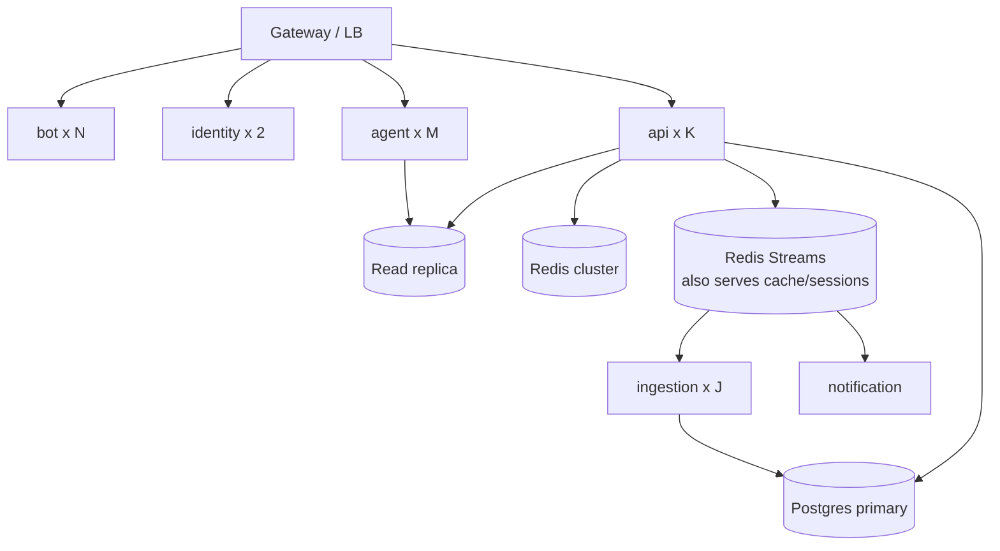

### Tier 2 — 100× (sharded, semantic search, async pipeline)

- Postgres partitioning by `tenant_id` (Postgres native or Citus)
- pgvector on dedicated nodes (or migrate to Qdrant if pgvector latency degrades)
- LLM provider failover + per-tenant model config
- Per-tenant LLM rate limit + budget enforcement
- Audit log → time-partitioned tables → object-storage archival
- CDN for cached policy reads
- Dedicated reranker service
- **Bus migration trigger may fire here**: if event volume sustained > 100k/s or retention demands grow, swap Redis Streams → NATS JetStream behind the `EventBus` abstraction

### Tier 3 — 1000× (multi-region, multi-cloud, regulated tenants)

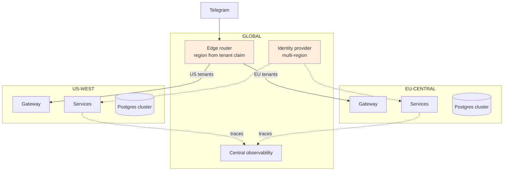

- Multi-region deployments for data residency (GDPR, regional compliance)
- Centralized identity with region claim; edge routes by claim
- BYO-LLM per tenant (Bedrock in customer VPC, Azure OpenAI)
- Per-region observability aggregated into a central pane
- Async ingest pipeline at scale (NATS JetStream by default at this tier; Kafka if ecosystem features required)
- Enterprise SSO (SAML / OIDC) replacing invite codes for large tenants
- Customer-managed encryption keys (CMEK) on Postgres + object storage
- Tenant-specific compliance certifications (SOC 2 Type II, ISO 27001, HIPAA where applicable)

### Operational concerns that grow with scale

- **Cost attribution**: every LLM call tagged with `tenantId`; daily aggregate → billing.
- **SLA**: API p99 < 300ms, agent reply p95 < 4s. Agent p99 dominated by Claude; tenant-visible SLAs honest about LLM-tail.
- **DR**: PITR on Postgres (WAL shipping to object storage), 30-min RPO, 1-hr RTO. Quarterly DR drill.
- **Security audits**: audit log + RLS gives an evidence chain. Required anyway for SOC 2 / ISO 27001.
- **Tenant offboarding**: full data export (every table is `tenant_id`-scoped, so it's `SELECT * WHERE tenant_id = $1` per table) + hard delete + audit attestation.

---

## 18. Migration path: MVP → production

In rough order. Each step is independently shippable; no rewrite at any point.

1. **Pull `agent/` out of `bot/`** — agent becomes a service; bot calls it over HTTP. Same interface, just a network hop. Required for independent scaling.
2. **Add identity service.** Move `/bindings` and API key issuance out of `api`. Introduce JWTs; deprecate long-lived per-tenant API keys for end users (keep them for service identity).
3. **Add Redis.** Session JWT cache, idempotency, rate-limit counters.
4. **Wire the gateway.** Edge JWT verification, WAF, IP rate limit. Move webhook entrypoint behind the gateway.
5. **Add Redis Streams + outbox table.** Writes append to outbox in the same DB tx; drainer publishes to Redis Streams; consumers are idempotent. Start with `policy.*` events. Migrate to NATS JetStream only when triggers in § 10 fire.
6. **Build ingestion worker.** Chunk + embed on `policy.*` events. Add `hybrid_search` tool to agent.
7. **Conversation memory in Redis.** Bot appends turns; agent loads recent turns; periodic summary worker.
8. **Observability**: OTel collector, LangSmith hookup, Prometheus, Loki, Sentry.
9. **mTLS via SPIFFE.** Replace static service auth.
10. **K8s + Helm + HPA.** Replace docker-compose. Multi-AZ first; multi-region later.
11. **Per-tenant LLM provider config.** Generalize the agent's model client.
12. **Partition Postgres.** Once single primary becomes a bottleneck.
13. **Multi-region.** Once data residency demands it.

---

## 19. What we'd do differently with more time

In rough priority order:

1. **End-user identity model** — per-user JWTs with role claims, replacing the chat-id-bound API key. Largest gap in MVP.
2. **Embeddings + semantic search** — second-biggest UX win.
3. **Conversation memory** — dramatic improvement even with a 5-turn rolling window.
4. **ACK tracking + admin commands** — the assignment's stretch goals, all schema-sketched.
5. **Streaming replies + typing indicators** — feels instantly more responsive.
6. **Real e2e tests** — Telegram synthetic-update tests in CI + contract tests between agent tools and API.
7. **Rate limiting + idempotency keys** — table stakes for production.
8. **OpenTelemetry instrumentation** — traces across bot → agent → API with `requestId` propagation.
9. **Admin web UI** — REST works; humans want a UI.
10. **Per-tenant LLM provider config** — unlocks enterprise sales.

---

## Appendix A — Trade-offs at a glance

| Decision | Chose | Alternative | Why |
|---|---|---|---|
| DB | Postgres + RLS | SQLite, MySQL, NoSQL | RLS is the strongest tenant-isolation story; Postgres also gets us FTS, pgvector, partitioning, mature replication. |
| Web framework | Hono | Express, Fastify, Next.js routes | Tiny, fast, runs on Node/Bun/Workers, excellent TS DX. |
| ORM | Prisma | Drizzle, raw SQL | Migrations, types, generator ergonomics. RLS via raw `SET LOCAL`. |
| Validation | Zod | Valibot, io-ts | Ubiquitous; pairs with `@hono/zod-openapi` and LangChain tool schemas. |
| Logging | Pino | Winston, Bunyan | Fastest JSON logger in Node; child-loggers fit per-request context. |
| Agent runtime | LangGraph (required) | Bare Anthropic SDK | Requirement; also: state machine semantics + retries + tool routing for free. |
| Telegram lib | `@chat-adapter/telegram` (required) | grammy, node-telegram-bot-api | Requirement; wrapped behind an adapter so we can swap. |
| Tenant id type | UUID | bigserial, ULID | Opaque, no enumeration, fits RLS. |
| Agent shape (MVP) | Library imported by bot | Separate service | Avoids a network hop without losing modularity; service in production. |
| Search (MVP) | Postgres FTS | Elasticsearch, Meilisearch | Free, in-DB, good enough. Pgvector added in production. |
| Concurrency control | `If-Match` + version int | Last-writer-wins, vector clocks | Simple, REST-idiomatic, sufficient. |
| Message bus | Redis Streams | NATS JetStream, Kafka, RabbitMQ | Reuses Redis we already operate. Migrate to NATS JetStream at high volume or cross-region; Kafka only at Tier 3 if ecosystem features needed. |
| Vector store | pgvector | Pinecone, Qdrant, Weaviate | Co-located with relational data; RLS extends to embeddings. Migrate if pgvector latency degrades. |
| User auth | JWT (Ed25519, short-lived) | Session cookies, opaque tokens | Stateless verification at edge; rotation via JWKS. |
| Service auth | mTLS via SPIFFE | Shared secret, gateway-only | Zero-trust between services; survives lateral movement. |
| Embedding model | Configurable per tenant | One global model | Enterprise tenants demand control over data flow to external providers. |

---

## Appendix B — Protocol matrix

Hop-by-hop transport. Two non-HTTP hops are deliberate.

| Hop | Protocol | Notes |
|---|---|---|
| Employee ↔ Telegram | HTTPS | Telegram's concern |
| Telegram → gateway → bot | HTTPS webhook + secret_token | replay-protected at gateway |
| bot → Telegram (`sendMessage`) | HTTPS | with retry / backoff / idempotency |
| bot → identity / api / agent (production) | HTTPS over mTLS | service mesh |
| bot → agent (MVP) | **in-process function call** | not HTTP |
| agent → api | HTTPS over mTLS + user JWT | tool calls |
| agent → LLM (Anthropic / Bedrock / Azure) | HTTPS | per-tenant configurable |
| api → Postgres | **Postgres wire protocol over TCP/TLS** | not HTTP |
| api → Redis | RESP3 over TCP/TLS | not HTTP |
| api / identity → message bus | RESP3 over TCP/TLS (Redis Streams); NATS protocol later if migrated | not HTTP |
| ingestion worker → pgvector | Postgres wire protocol over TCP/TLS | not HTTP |
| all services → secret manager | HTTPS (gRPC) | via Workload Identity |
| all services → OTel collector | OTLP/gRPC | not HTTP |

---

## Appendix C — Glossary

| Term | Meaning |
|---|---|
| **RLS** | Row-Level Security — Postgres feature enforcing per-row visibility via policies on the table. |
| **ALS** | `AsyncLocalStorage` — Node's request-scoped context propagation. |
| **JWKS** | JSON Web Key Set — public-key endpoint for JWT signature verification. |
| **SPIFFE / SPIRE** | Workload identity standard / reference implementation for service mTLS. |
| **HNSW** | Hierarchical Navigable Small World — graph-based ANN index, used by pgvector. |
| **FTS** | Full-Text Search — Postgres `tsvector` / `tsquery`. |
| **RRF** | Reciprocal Rank Fusion — score-fusion algorithm for hybrid retrieval. |
| **DLQ** | Dead-Letter Queue — sink for messages that repeatedly fail processing. |
| **HPA** | Horizontal Pod Autoscaler — K8s component scaling replicas on metrics. |
| **PITR** | Point-in-Time Recovery — restore DB to any moment within retention window. |
| **CMEK** | Customer-Managed Encryption Keys — tenant supplies the KMS key used to encrypt their data. |
| **BYOK / BYO-LLM** | Bring Your Own Key / LLM — tenant uses their own credentials or model deployment. |
