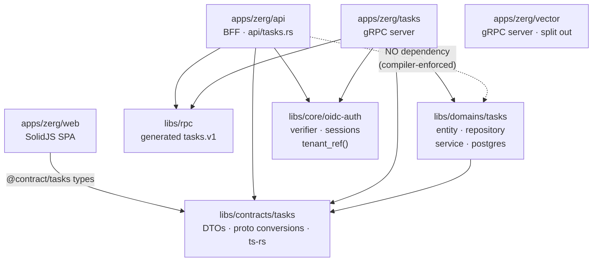
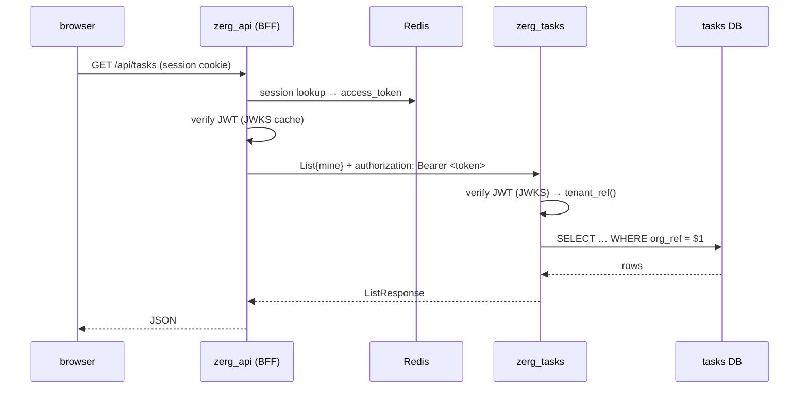
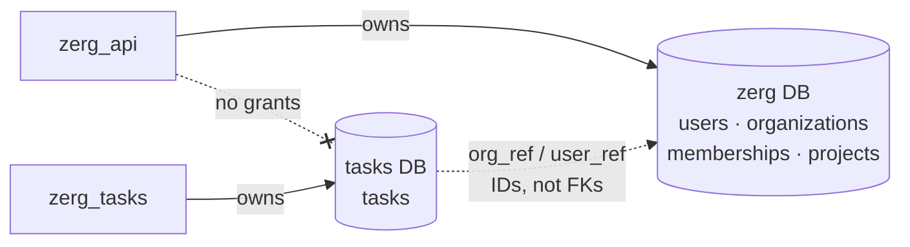

# ADR: Fix the `tasks` service boundary — contract-only deps, own data, verified identity

- **Status:** Accepted — all five phases implemented 2026-07-25
- **Date:** 2026-07-25
- **Deciders:** yurikrupnik
- **Supersedes:** the "done right" verdict in `docs/architecture-review-todo.md` Issue 4
- **Related:** `docs/modular-monolith-architecture.md`, `docs/grpc.md`, `docs/auth-idp-decision.md`

## Context

`apps/zerg/tasks` is our only synchronous service extraction. A prior review graded it
"a proper microservice extraction, done right" on the strength of its **resilience
infrastructure** — lazy connect, pooled client, health-gated `/ready`, keep-alive,
timeouts, retry helper. All of that is real and stays.

That review did not audit **boundary hygiene**: dependency direction, data ownership,
and authentication at the hop. On those three, the split did not hold up. The table below
is the **audit snapshot of 2026-07-25, before any remediation** — it is kept as the
historical record that motivated this ADR, so it cites files that Phases 1–2 have since
deleted (`api/tasks_direct.rs`) or moved. For live status see the phase notes below and
the checklist table in `docs/modular-monolith-architecture.md`.

| Requirement | State | Evidence |
|---|---|---|
| Client depends on the contract only | ❌ | `apps/zerg/api/Cargo.toml` and `apps/zerg/tasks/Cargo.toml` both depend on `domain_tasks`; `api/tasks_direct.rs:2` imports `PgTaskRepository, TaskService, handlers` |
| Service exclusively owns its data | ❌ | Two writers on one table: `api/tasks_direct.rs:5` and `tasks/src/server.rs:71` both build `PgTaskRepository` |
| Boundary is authenticated | ❌ | `org_id`/`user_id` arrive as plaintext proto fields; `required_uuid()` validates shape, not entitlement |
| Independent deployability | ❌ | Shared crate ⇒ a domain model change recompiles both; the `tasks` → `tasks.v1` package rename broke both simultaneously |
| Independent failure | ❌ | `api/health.rs:40` gates `/ready` on `tasks_grpc`; tasks down ⇒ projects, users, org endpoints all stop serving |
| Service owns its schema | ❌ | `tasks` table is defined in `manifests/db/zerg/schema.sql` |
| One process, one capability | ❌ | `tasks/src/server.rs:101-102` hosts `TasksServiceServer` **and** `VectorServiceServer` — tasks cannot scale without scaling vector |

Two consequences are not theoretical. Adding tenant scoping required applying identical
`org_id` filters to **both** paths, because `/api/tasks-direct` is a live, unscoped-by-
default window onto the same rows — miss it and tenant isolation is bypassable. And the
tenant boundary is currently enforced only in the caller: anything that can reach
`:50051` can read any organization's tasks by sending different bytes.

The honest summary is that we pay network cost for module-level coupling. The prior
review's "the only way tasks could drift toward a distributed monolith is a second sync
hop" understated it — a caller reaching directly into the service's table is the more
serious form, and it is already present.

## Decision

Keep the split. Fix the boundary so it is a boundary. Five phases, each leaving the tree
green and independently valuable.

### Guiding rule

> The client depends on the **contract**, never on the service's internals. The service
> owns its **data** and derives **identity** from a verified token, never from a field
> the caller filled in.

### Target architecture

**Crate dependencies after all five phases.** The arrow direction is the whole point:
`zerg_api` and `domain_tasks` become siblings that both depend on the contract, and
neither can reach the other.



The dotted non-edge is the invariant Phase 2 establishes and
`grep -rn "domain_tasks" apps/zerg/api/` protects.

**Request flow.** Identity is verified twice from the same token — once by the BFF for
its own routes, once by the service for its own data. Neither trusts a field the other
filled in.



**Data ownership.** Each service owns one database; references across the boundary are
opaque IDs, never foreign keys.



### Phase 1 — Delete the bypass

One door to the data.

- Delete `apps/zerg/api/src/api/tasks_direct.rs` and its `/tasks-direct` mount in `api/mod.rs`.
- Delete `direct_router` and `handlers/direct.rs` from `domain_tasks`; drop `DirectApiDoc`
  from `openapi.rs`.
- Remove `PgTaskRepository`/`TaskService` construction from `zerg_api`.

Clean cutover, no compatibility alias. This alone removes the isolation-bypass class of bug.

**Shipped 2026-07-25.** `/api/tasks-direct` returns 404 and the OpenAPI spec lists only
`/tasks` and `/tasks/{id}`. The eight `bench-*-direct` recipes went too — `bench-tasks-compare`
/ `bench-cluster-compare` had nothing left to compare and are now `bench-tasks-all` /
`bench-cluster-all`.

### Phase 2 — Invert the dependency

Today the caller's HTTP→gRPC handlers ship *inside the callee's* crate. Split
`domain_tasks` in two:

```
libs/contracts/tasks          NEW — the published contract
  ├─ Task, CreateTask, UpdateTask, TaskFilter   (ts-rs export → web)
  └─ proto ↔ DTO conversions
        ↑                                    ↑
apps/zerg/api (client)              libs/domains/tasks (server-only)
  └─ api/tasks.rs                     ├─ entity.rs, postgres.rs
     (moved from handlers/grpc.rs)    ├─ repository.rs, service.rs
                                      └─ maps internal Task ↔ contract
```

- Move `models.rs` + `conversions.rs` → `libs/contracts/tasks` (crate `contract_tasks`).
- Move `handlers/grpc.rs` → `apps/zerg/api/src/api/tasks.rs` (its caller's home).
- `zerg_api` drops the `domain_tasks` dependency entirely; it depends on `rpc` +
  `contract_tasks`. `TaskScope` moves to the contract crate.
- `apps/zerg/web` imports the types as `@contract/tasks`, emitted by the contract crate
  into `libs/contracts/tasks/types/`. Update the Vite alias and workspace globs.

**Test:** `grep -rn "domain_tasks" apps/zerg/api/` returns nothing.

**Shipped 2026-07-25.** Two decisions worth recording:

- **`TaskPriority`/`TaskStatus` carry SeaORM `ActiveEnum` derives** because the entity
  uses them as column types, and the orphan rule forbids `domain_tasks` implementing
  `ActiveEnum` for a foreign type. They sit behind a `contract_tasks/orm` feature that
  only `domain_tasks` enables, so the client never compiles ORM code.
- **`TaskError` split by direction.** It previously served both sides: the server mapped
  domain errors *out*, while the client mapped `tonic::Status` *in* via
  `From<TaskError> for AppError` and `from_status`. That round-trip only existed because
  both shared a crate. Now `domain_tasks::TaskError` is server-only and transport-free,
  `apps/zerg/tasks` maps it to a `Status`, and `zerg_api` maps `Status` → `ApiError`
  directly. `domain_tasks` consequently dropped 16 dependencies including `axum`,
  `axum-helpers`, `utoipa`, `tonic`, `rpc` and `ts-rs` — a data-owning service crate
  should need no HTTP framework, and now it demonstrably does not.

This also fixed a latent bug the shared crate had hidden: `apps/zerg/tasks` blanket-mapped
every failure (`get_by_id` → `not_found`, everything else → `internal`), so a DB outage
reported 404 and `PUT`/`DELETE` on a missing task reported 500. A `to_status` helper now
maps per variant; the test that asserted `Code::Internal` for a missing task was encoding
the bug and now asserts `Code::NotFound`.

### Phase 3 — Own the data

The service gets its own database, so the bypass becomes *impossible* rather than merely deleted.

- New `manifests/db/tasks/{schema.sql,seed.sql}` in declarative mode (matching zerg).
  Add `CREATE DATABASE tasks;` to `manifests/dockers/config/postgres-init/01-create-databases.sql`
  and `tasks-local`/`tasks-cluster` to `_db-url` in `manifests/db/db.just`.
- Drop the `tasks` table from `manifests/db/zerg/schema.sql`.
- **Cross-service references become IDs, not foreign keys** — the defining trade of a
  service boundary. We give up referential integrity across it deliberately:

  ```sql
  org_ref    TEXT NOT NULL,   -- was org_id  UUID REFERENCES organizations(id)
  user_ref   TEXT NOT NULL,   -- was user_id UUID REFERENCES users(id)
  project_id UUID,            -- was FK to projects; now an opaque id
  ```

  `org_ref`/`user_ref` hold IdP identifiers (`org_01…`, `user_01…`, or `personal:{sub}`),
  which is exactly what a verified token carries — that is what makes Phase 4 possible.
- `zerg_api`'s DB role gets no grants on the tasks database.
- Deleting a user/org no longer cascades. Handle it with an event (`UserDeleted`) on the
  existing NATS infrastructure, or accept orphans. **Decision: accept orphans for now** —
  tasks are cheap, and account deletion isn't implemented. Revisit when it is.

Dev migration is `just db-fresh`. No production data exists; if that changes before this
lands, it becomes a one-time ETL joining `tasks → users/organizations` to resolve refs
*before* the table moves.

**Shipped 2026-07-25.** `manifests/db/tasks/` holds `schema.sql`, `seed.sql`, `roles.sql`
and declarative k8s artifacts; `tasks` is gone from the zerg schema, seed and configmap.
The `tasks_app` role owns the new database and `zerg_api` has no credentials for it.
Two things the ADR did not anticipate:

- **`TaskFilter.user_id` had to become `mine: bool` here, not in Phase 4** — the moment
  `list` scopes by a token-derived ref, a caller-supplied user id has nothing to compare
  against. `list` therefore takes the whole `TaskScope`, not just `org_ref`.
- **A `tasks_touch_updated_at` trigger was orphaned in zerg's schema** when the table
  moved. It now lives with the table.

### Phase 4 — Authenticate the boundary

Stop trusting caller-supplied identity.

- `zerg_api` forwards the session's WorkOS access token as `authorization: Bearer …`
  gRPC metadata (the token is already in the Redis `SessionRecord`).
- `zerg_tasks` verifies it with `oidc_auth::OidcVerifier` (JWKS/RS256 — already built,
  already used) and derives the tenant itself.
- Add `AuthIdentity::tenant_ref()` to `libs/core/oidc-auth`, returning the org claim or
  `personal:{subject}`. This logic is currently duplicated in `zerg_api/src/orgs/mod.rs`
  and `terran/api/src/provisioning.rs`; centralizing it means both services derive an
  identical ref from the same token with zero coordination.
- **Remove `org_id`/`user_id` from every proto request message.** They become
  underivable-from-the-caller, which is the point. Responses keep `org_ref`/`user_ref`
  for display.
- `ListRequest.user_id` becomes `bool mine`. The client says *whether* to narrow to the
  caller, never *whose* tasks to fetch — the request can no longer express "someone
  else's tasks".

This is a **breaking wire change**, deliberately taken as one coordinated release while
we are pre-production. It is the last one (see Phase 5).

**Shipped 2026-07-25.** Removed fields are `reserved` (number *and* name) in every
message, so the tags can never be silently reused — the additive-only policy is now
enforced by the proto itself. `oidc_auth::AccessToken` was added: `auth_required` inserts
the verified token into request extensions (taken *after* the lazy refresh, so a
forwarded token is never one about to expire mid-flight), and the BFF forwards it.
`zerg_api`'s tenant middleware no longer injects a task scope at all — anything it
resolved locally would be an untrusted duplicate of what the service derives itself.

Verified by attacking it. `apps/zerg/tasks/tests/boundary_smoke.rs` (ignored by default;
run with `--ignored` against a live server) calls `:50051` directly, bypassing the BFF:
an unauthenticated call and a forged-token call both return `Unauthenticated`. Before
this phase, either would have returned any organization's tasks for the asking.

The service's own tests changed shape accordingly: `test_get_task_cross_org_not_found`
now varies the *verified scope* rather than a request field, and the two
`missing_org_rejected` tests became `without_token_is_unauthenticated` — the failure
mode that replaced the one they were written for.

### Phase 5 — Make deployment independent

- Remove `tasks_grpc` from `/ready` (`api/health.rs:40`). Keep it in `/health` as
  information. Tasks routes return `503` when the channel is unavailable; every other
  route keeps serving.
- Set **per-call deadlines** on `TasksServiceClient` calls rather than relying on the
  30s channel default. (Closes the open item at `architecture-review-todo.md:85`.)
- **Proto policy from here: additive only.** Never renumber or remove a field; never
  rename a package. Deprecate instead. A field removal requires two releases —
  stop reading it, ship, then delete it.
- **Split `VectorService` into its own binary.** `zerg_tasks` currently hosts both, so
  "scale tasks independently" is false today. Two thin `main.rs` over the existing
  service impls; no domain code moves.

**Shipped 2026-07-25.** `/ready` now checks only what the process owns (database,
redis); downstream reachability moved to an informational `/upstreams` that always
returns 200. Confirmed by killing the tasks service: `/ready` stays 200, `/api/projects`,
`/api/org` and `/api/auth/me` keep serving, and only `/api/tasks` degrades to 503.
Per-call deadline is 5s (`TASKS_CALL_TIMEOUT`). `apps/zerg/vector` is a separate crate
and binary; `zerg_tasks` now advertises only `tasks.v1.TasksService`.

## Consequences

**We gain** a boundary that holds: the client cannot reach the service's data or
internals, the service authenticates its own callers and derives tenancy from a verified
token, and either side can deploy or fail without the other.

**We accept**
- No referential integrity between tasks and users/orgs. Orphan rows are possible.
- A second database to operate (already routine — `terran` is one).
- Cross-service joins are gone: rendering "task owner name" needs the caller to resolve
  `user_ref`, not a SQL join. Today's UI shows no owner names, so nothing regresses.
- Token verification on the tasks hot path — a JWKS-cached RS256 verify, the same cost
  `zerg_api` already pays per request.

**We reject** the alternative of a *trusted subsystem* (service credential + tasks
trusting the caller's resolved UUIDs). It is less work and keeps the FKs, but leaves the
service unable to verify tenancy independently and keeps two services co-owning one
table — the exact coupling this ADR exists to remove.

**Revisit if** the token-forwarding hop proves too costly for machine clients that hold
no user token; the fallback is a WorkOS service-account token verified through the same
JWKS path, not a return to plaintext fields.

## Scope note

This ADR covers the `tasks` boundary only. It does **not** propose extracting `projects`,
`users`, or `cloud_resources` — those stay in-process until a concrete runtime need
appears. Nor does it revisit auth: `oidc-auth` remains a shared library, per
`docs/auth-idp-decision.md`.
