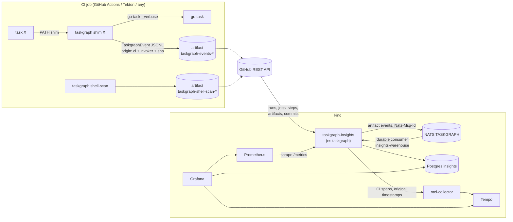

# CI & developer insights

Observes three things and puts them on Grafana dashboards in the local kind
cluster:

1. **CI runs**: every GitHub Actions workflow run, job and step, plus the
   `task` calls inside them. The collection works for any CI because it
   happens at the go-task layer.
2. **Shell code**: at runtime (every task execution: duration, outcome, the
   commands it ran) and statically (shellcheck findings, size and complexity
   of every script and Taskfile snippet, and who owns it).
3. **Contributors**: an outcome scorecard per contributor. It covers humans,
   AI coding agents and bots, and says why each one ranks where it does.

Nothing is SaaS. CI only writes artifacts, and a service inside kind pulls
them. The tooling decision (Grafana + Prometheus + Tempo + OpenTelemetry
Collector, currently a `trial`) is in
[docs/tooling/ci-observability.md](tooling/ci-observability.md).

## Architecture



| Piece | Where | README |
|---|---|---|
| Event + shell-scan contract (`RunOrigin`, `CiContext`, `Invoker`, `ShellScan`) | `libs/contracts/taskgraph` | — |
| Human/agent/bot rules and the agents registry | `libs/core/authorship` (`agents.json`) | — |
| CLI: `run`, `shim`, `shell-scan`, `ingest` | `apps/taskgraph/cli` | [README](../apps/taskgraph/cli/README.md) |
| Drill-down UI and live metrics (origin per run) | `apps/taskgraph/api` | [README](../apps/taskgraph/api/README.md) |
| Sync service and its domain logic | `apps/taskgraph/insights`, `libs/domains/insights` | [app](../apps/taskgraph/insights/README.md), [domain](../libs/domains/insights/README.md) |
| Analytics DB (Atlas, versioned) | `manifests/db/insights` | — |
| Monitoring stack + dashboards | `manifests/observability`, `scripts/tasks/observability.yml` | — |
| CI wiring | `.github/actions/taskgraph`, `.github/workflows/{ci-optimized,taskgraph-cli}.yml` | — |
| Tekton wiring | `butler.toml` `[tekton.taskgraph]`, `apps/butler/cli/src/tekton` | [tilt-generators](tilt-generators.md) |
| Attribution hooks and check | `tools/authorship`, `lefthook.yml`, `scripts/tasks/authorship.yml` | — |

## Run it

```bash
# 1. Monitoring stack (refuses any context that is not kind-*)
OBS_CONTEXT=kind-<cluster> task observability-up

# 2. Postgres + NATS in namespace `dbs` come from devkit (`task local-up`)

# 3. Analytics DB and the service's Secret (the token comes from `gh auth token` and is never written to disk in the repo)
TARGET=kind task insights-db
task insights-secret

# 4. The service: `tilt up` (resource taskgraph-insights, :5263), or
kubectl apply -f manifests/k8s/dev/taskgraph-insights.yaml
```

Grafana runs at <http://localhost:55558> (dev login admin/admin; Tilt
port-forwards it) and the dashboards are in the **CI insights** folder:

| Dashboard | Shows |
|---|---|
| CI overview | Runs per day by workflow and conclusion, success rate, p50/p90 duration and queue time, slowest jobs and steps, re-run rate, recent failures linked to GitHub and to the Tempo trace |
| Task runtime | Task p50/p90 over time, failure rate, flaky tasks (same sha, both outcomes), CI vs local, invoker (human / agent / ci), slowest tasks by self time, live `taskgraph_*` Prometheus panels |
| Shell static | Findings over time by level, lines and branches over time, top shellcheck codes, worst sources with their owner, shell size per task |
| Team scorecard | The ranked outcome scorecard with `why`, a separate activity table (context only, not ranked), human vs human+agent vs agent vs bot vs unknown, commits per week by kind and attribution, sync status |

**Without kind:** `docker compose -f manifests/dockers/compose.yaml up -d postgres nats`,
then `task insights-db` and `task insights-sync` run one cycle from the host
(`BACKFILL_DAYS=90` by default).

## CI capture

`.github/actions/taskgraph` runs in every `ci-optimized.yml` job that calls
`task`. It downloads the `taskgraph` binary from the rolling release
`taskgraph-cli-latest` (published by `.github/workflows/taskgraph-cli.yml`,
static musl, sha256-checked) and puts a `task` shim first on `PATH`. Every
existing `run: task …` line then becomes `taskgraph shim …` without any edit to
the line itself. The events go to `$RUNNER_TEMP/taskgraph/events-<job>.jsonl`,
and an `always()` step uploads them as `taskgraph-events-<job>-<attempt>`.

If any step fails (no release yet, checksum mismatch, a release that predates
`shim`), the action prints `::warning::` and plain go-task runs. Telemetry
never fails CI. The release workflow only runs on pushes to `main`, so CI stays
unobserved until that has happened once.

- **Other CIs.** The shim is CI-agnostic. `RunOrigin.ci` is detected for
  GitHub Actions, GitLab CI, Buildkite, CircleCI and Jenkins. Anything else
  sets `TASKGRAPH_CI_PROVIDER` and `TASKGRAPH_CI_RUN_ID`, and the rest of the
  `TASKGRAPH_CI_*` variables are optional.
- **Tekton.** `[tekton.taskgraph]` in `butler.toml` makes the generated go-task
  runner fetch the same binary and publish straight to NATS, since it runs
  inside the cluster. Leave the table out and the runner is the old plain
  go-task. The asset is x86_64-only; an arm64 node runs it under emulation or
  falls back to plain go-task.
- **Shell scan.** The `shell-scan` job uploads `taskgraph-shell-scan-<attempt>`.
  `task shell-scan` runs the same scan locally and writes
  `dist/shell-scan.json`.
- **Steps that are not `task`.** `bun nx …`, `bunx biome …` and inline bash are
  still timed, but only as GitHub job steps (`ci_steps_v`), not as task
  executions.

## Attribution: human, agent or bot

`libs/core/authorship/agents.json` is the only registry. Both the Rust
classifiers and the TypeScript hooks read it.

- **Runtime.** An agent shell is recognised by the markers the agent exports.
  They are checked in registry order, and the first match wins: `OMPCODE`,
  `CLAUDECODE`, `CODEX_*`, `GEMINI_CLI`, `COPILOT_CLI`, `CURSOR_AGENT`, … and
  then the generic `AI_AGENT`/`AGENT`. Every `taskgraph run` records
  `invoker = agent | ci | human`, in that order of precedence.
- **Commits.** The `prepare-commit-msg` hook adds
  `Assisted-by: <agent-id>[:<model>]` in an agent shell, and `commit-msg`
  rejects an agent commit without it, or any unknown agent id.
  **The hooks only run after `lefthook install`.** In Claude sessions,
  `.claude/hooks/guard-git.js` refuses `git commit` until the hooks are
  installed.
- **CI.** `task authorship-check RANGE=<base>..<head>` (the `authorship` job
  on pull requests) validates every trailer. CI cannot detect an agent commit
  that has no trailer; only the local hooks can.
- **Classification.** An identity registered to an agent (e.g.
  `claude-maintenance[bot]`) is that agent. Any other `[bot]` identity is a
  bot. Everyone else is human. Trailers add assistants to a commit; they never
  change the author's kind. `Co-authored-by:` with a registered agent email
  counts as well.
- **Legacy history.** Commits before `enforcedSince` (2026-09-27) are
  `legacy`, and a missing trailer there proves nothing. `kind_scorecard` puts
  them in a separate `unknown` bucket, and the scorecard's `why` says
  "legacy attribution: agent share unknown".

## Scorecard: what ranks and why

`scorecard(from, to, min_commits = 5)` covers commits authored in the window.
A contributor's commits are the ones they authored plus the ones they
assisted, so an agent is scored on the commits it helped with.

| Metric (ranks) | Definition |
|---|---|
| first_pass_rate | Of commits that were the head of at least one counted CI run, the share whose every attempt-1 conclusion was `success` |
| change_failure_rate | Share of commits later reverted (`This reverts commit <sha>`) |
| fixup_rate | Share followed within 7 days by a `fix` commit, from anyone, touching at least one of the same files |
| lead_time_h | Median hours from authoring to the first successful counted `push` run on the default branch created after the commit |
| task_failure_rate | Failed / (succeeded + failed) task executions in attempt-1 CI runs of that commit |

- **Counted runs** are the workflows listed in `INSIGHTS_CI_WORKFLOWS`
  (default `.github/workflows/ci-optimized.yml`).
- **Score.** `outcome_score = 100 × (0.30·first_pass + 0.25·(1−change_failure)
  + 0.15·(1−fixup) + 0.15·1/(1+lead_time_h/24) + 0.15·(1−task_failure))`.
  - A contributor's missing metric takes the team value, so it is neutral.
  - A metric nobody has data for is dropped, and the remaining weights are
    renormalised.
- **Ranking.** Rank is by score, among contributors with at least
  `min_commits` commits.
- **`why`.** It names the two metrics furthest above the team value and the
  worst one.
- **Activity** (commits, lines, active days, CI runs) is shown next to the
  ranking but never ranks. It is cheap to inflate, and agents always win it.

## Shell static analysis

`taskgraph shell-scan` lints two kinds of source:

- every tracked `*.sh`/`*.bash` file, plus extension-less files with a sh or
  bash shebang;
- every task's `cmds`, `status` and `preconditions` from the parsed Taskfile
  graph.

**How snippets are checked**

- Snippets are linted with `shellcheck --shell=bash`. go-task runs them through
  mvdan/sh, and this repo writes bash.
- `{{…}}` templates are replaced by `__TPL__` before linting, and findings that
  land exactly on a placeholder are dropped.
- SC1091, SC2148 and SC2154 are excluded for snippets. The reasons are in
  `libs/domains/taskgraph/src/shell.rs`.

**What each source records**

- `lines`: lines that are not blank and not comments.
- `branches`: `if`/`elif`/`case`/`for`/`while`/`until` plus `&&` and `||`,
  counted lexically.
- `owner`: the author with the most changed lines on that path.

Scans only observe: findings never fail CI. The `observe-only` gap in
`docs/tooling/registry.toml` records this.

## Limits

- **Pull, not push.** Dashboards are as fresh as the last sync
  (`INSIGHTS_SYNC_INTERVAL`, default 10m).
- **GitHub data.** Commits come from the default branch plus every workflow
  run's head sha. Work that never reaches `main` shows up only through its
  runs.
- **Retention.** GitHub keeps artifacts for 14 days (`retention-days`), so a
  sync outage longer than that loses those task events. Workflow runs, jobs
  and steps stay available.
- **Re-ingesting.** Nats-Msg-Id only deduplicates inside the stream's 2-minute
  window. Re-ingesting an artifact later is safe because the service keeps a
  ledger of artifact ids and the warehouse is idempotent on `event_id`.
