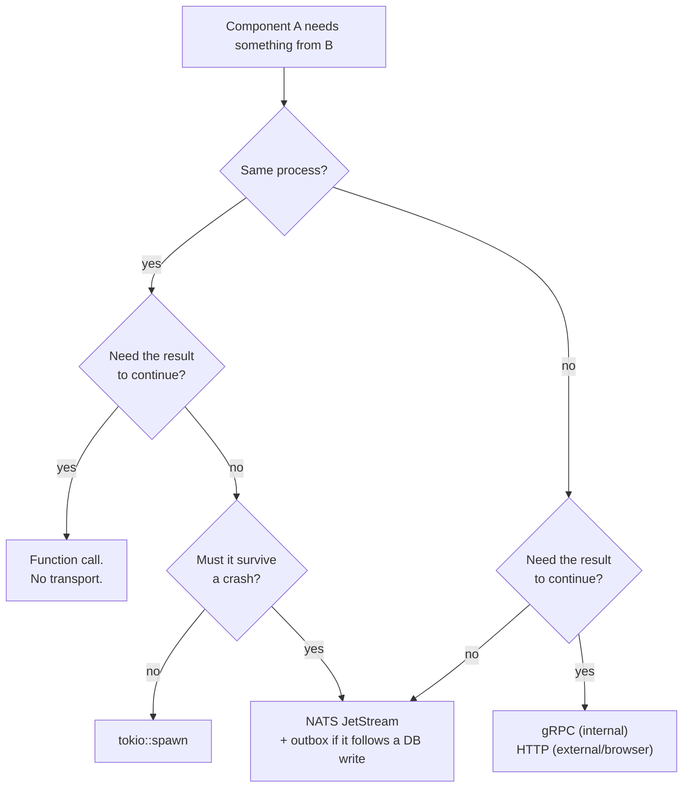
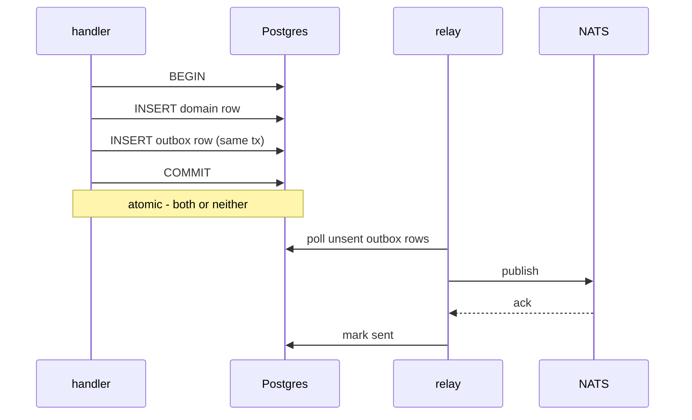

# Communication & Consistency: NATS, gRPC, HTTP, and Sagas

- **Status:** Living guide
- **Date:** 2026-07-25
- **Related:** [`adr-tasks-service-boundary.md`](./adr-tasks-service-boundary.md),
  [`modular-monolith-architecture.md`](./modular-monolith-architecture.md),
  [`grpc.md`](./grpc.md), [`messaging-patterns.md`](./messaging-patterns.md)

How components in this repo talk to each other, and what to do when a flow spans more
than one system. [`messaging-patterns.md`](./messaging-patterns.md) is the technology
*reference* (Kafka, RabbitMQ, Redis Streams). This is the *decision* guide for the three
transports we actually run: **NATS JetStream**, **gRPC**, and **HTTP**.

---

## 1. Pick a transport

Start here. The first question is not "sync or async" — it is whether you need a
transport at all.



**The rule:** a transport is justified by a *runtime* need — durability, decoupling,
independent failure — never by tidiness. Two modules in one process that want to be
"decoupled" want a trait, not a queue.

### Quick table

| Need | Use | Example here |
|---|---|---|
| Caller needs the answer to continue | **gRPC** | `zerg_api` → `zerg_tasks` list/create |
| Browser or third party calls us | **HTTP** | web → `zerg_api`; `zerg_api` → WorkOS API |
| Work that must happen, but not now | **NATS JetStream** | welcome/verification email jobs |
| Fan-out to N independent consumers | **NATS JetStream** | `TodoEvent` → worker (+ future analytics) |
| Same process, need the result | **function call** | `TaskService` → `PgTaskRepository` |
| Same process, fire-and-forget, loss OK | `tokio::spawn` | best-effort cache warm |

---

## 2. When to use NATS

We run NATS JetStream through [`libs/core/messaging`](../libs/core/messaging/src) —
producer, pull consumer, worker loop, DLQ, metrics, health. Two live consumers:
`apps/zerg/email-nats` and `apps/todo/worker`.

### Reach for it when

- **The caller must not wait.** Sending a welcome email should not be on the login
  critical path, and email provider latency should never become login latency.
- **The work must survive a crash.** JetStream persists; `tokio::spawn` does not.
- **You want fan-out.** N consumers each get every message — analytics, search
  indexing, audit — and the producer never learns they exist.
- **You want a work queue.** N replicas *share* the messages (competing consumers).
  See the durable-name rule below; this is where it goes wrong.
- **You need retry and poison-pill handling.** `max_deliver`, `ack_wait`, DLQ routing
  are already wired in `libs/core/messaging/src/nats/`.
- **You need load levelling.** A burst enqueues instead of melting a downstream.

### Do not reach for it when

- The caller needs the result. A queue plus a reply subject is a slow, fragile RPC.
- It's a read. Reads want request/response.
- You need an answer within one request. NATS gives you *eventually*, not *now*.
- You just want modules decoupled inside one process. Use a trait —
  `TodoEventPublisher` in `libs/domains/todo/src/events.rs` is the pattern, and
  `NoopPublisher` shows why it's nice for tests.

### Commands vs events — choose deliberately

| Shape | Producer says | Coupling | Use when |
|---|---|---|---|
| **Command** — `queue_welcome_email` | *what should happen* | producer knows the consumer's job | exactly one consumer, and it will stay that way |
| **Event** — `UserRegistered` | *what happened* | consumer decides what it means | more than one interested party, now or later |

We publish both today: `libs/notifications/email` takes commands
(`queue_welcome_email`, `queue_task_notification`), `libs/domains/todo` publishes events
(`TodoEventKind::{Created, Updated, Completed, …}`).

The cost of a command shows up with the second consumer: when analytics also wants to
know a user registered, the API must add a second publish. With an event, nothing on the
producer changes. **Default to events for domain facts; commands only for a genuinely
single-consumer job.**

### Fan-out or work queue: how you control it

> **The consumer name *is* the consumer group** — exactly like Kafka.
> Replicas sharing a name **compete** (each message handled once). Different names each
> get their **own cursor** (each receives every message).
>
> Fan-out is therefore something you get *between groups*, never between replicas of one
> worker.

Two levers, and you should normally set both:

**1. The consumer name (client side).** `WorkerConfig::from_stream::<S>()` uses
`S::CONSUMER_NAME` verbatim, so every replica joins one group. That is the default and
you should rarely override it. For the genuinely rare case where each replica must see
every message — in-memory cache invalidation, config reload — opt in explicitly with
`WorkerConfig::with_per_instance_broadcast()`. Never for work with side effects: N
replicas will perform it N times.

**2. The stream kind (server side).** `StreamConfig::KIND` declares what the stream *is*,
and stream creation derives retention from it:

| `KIND` | Retention | Meaning |
|---|---|---|
| `JobQueue` *(default)* | `WorkQueue` | One group only. Message deleted on ack. NATS **refuses** a second overlapping consumer, so fan-out is impossible. |
| `EventLog` | `Limits` | Many groups may subscribe. Retained by age/count, so a group added later can replay history. |

Choose `JobQueue` when the work must happen exactly once (`EMAILS`). Choose `EventLog`
for domain facts other components may react to later (`TODOS`).

Two traps worth knowing:

- **`Interest` retention is not the event-log answer.** It drops messages published while
  no consumer exists, and a group added later receives nothing published before it — the
  opposite of what an event log is for. Use `Limits`.
- **Retention cannot be changed in place.** Switching a live stream's kind means deleting
  and recreating it. Decide before there is traffic worth keeping.

Both halves are asserted against a real server in
`libs/core/messaging/tests/stream_kind_it.rs`: an `EventLog` delivers every message to
each group, and a `JobQueue` **refuses** the second group. For the client half, run
`just email-replica-check` (one delivery for one job) or `just email-scale-check` under
load.

### When you actually want fan-out

Fan-out is worth it when a **second, different reader** wants the same message for its
own purpose. The test is not "do I have several replicas" — replicas share one group and
that is a work queue. It is *"will something else, owned by someone else, care about this
fact?"*

**Nothing in this repo needs fan-out today.** `EMAILS` is correctly a job queue, and
`TODOS` is an `EventLog` with exactly one group whose processor only counts events
(`apps/todo/worker/src/lib.rs`). The kind was chosen to leave the door open, not because
a second reader exists.

**The first real case is already planned: `DocumentUploaded`** (item 3.4). That backlog
entry justifies itself on precisely this ground — an *event*, not a `queue_embedding_job`
command, "because search indexing and thumbnailing will want it later". Its shape:

```
DOCUMENTS (EventLog)
  ├── group "vector-indexer"  -> fetch, chunk, embed, upsert to Qdrant
  ├── group "thumbnailer"     -> render a preview
  └── group "search-indexer"  -> text index
```

Each group load-balances internally across its own replicas. Adding the fourth group
later touches no producer and no existing consumer — that is the whole return on
choosing `EventLog`.

**Do not reach for per-instance broadcast.** It is a different mechanism for per-process
state (in-memory cache invalidation, config reload), and no current component needs it:
the JWKS cache (`libs/core/oidc-auth/src/verifier.rs`) refreshes by key id, the email
template cache loads from disk at startup, and the remaining in-memory maps are test
doubles. `with_per_instance_broadcast` should stay uncalled until something genuinely
holds state that an event must invalidate.

**The asymmetry that should drive the choice:** adding a reader later is free on an
`EventLog` and impossible on a `JobQueue`, and retention cannot be changed in place — so
guessing wrong on a job stream costs a drain-and-recreate. That is *not* an argument to
default to `EventLog`: doing so forfeits the server-side exclusivity that makes duplicate
processing unrepresentable. Ask whether the message is a **job** (someone must do it once)
or a **fact** (something happened). Jobs are `JobQueue` even if you are unsure who might
watch later; facts are `EventLog` even if only one reader exists today.

### What happens when a job keeps failing

The worker classifies every `ProcessingError` and acts on the **server's** attempt
count, `NatsMessage::delivery_count` — never a counter in the payload. A `nak` asks
JetStream to redeliver the stored bytes, so anything the consumer increments is thrown
away. (This was live defect 0.4: a payload counter pinned at 0 made the DLQ branch
unreachable and flattened exponential backoff to a constant.)

| Outcome | When | What the worker does |
|---|---|---|
| **Retry** | `Transient`/`RateLimited`, attempts left in both the category budget *and* `max_deliver` | `nak_with_delay` with exponential backoff |
| **DLQ** | `Permanent`, or budget spent, or this is the final `max_deliver` attempt | write a `DlqEntry`, then `term` |
| **DLQ (poison)** | the payload did not deserialize | capture the raw bytes, then `term` — redelivery cannot fix bytes |

The `max_deliver` check matters because the two ceilings disagree: `RateLimited` permits
5 retries while `EMAILS` sets `max_deliver = 5`. Without it, the server stops
redelivering one attempt *before* the policy gives up, and the message disappears.

### The DLQ has no consumer, on purpose

A message reaches the DLQ only after automatic retry is exhausted. A daemon that
reprocesses it is the same failure on a slower loop — and for a poison pill, an infinite
one across two streams. So the DLQ is operated, not consumed:

1. **Alarm.** `nats_worker_dlq_depth` is published once per batch. Non-zero is a page,
   not a metric nobody reads. *(Nothing is wired to alert on it yet — backlog 0.6.)*
2. **Inspect.** `nats stream view EMAILS_DLQ`. Every entry carries `job_type`,
   `original_subject`, `delivery_count` and the error string.
3. **Fix, deploy, then redrive.** `DlqManager::redrive(start_sequence, limit)`
   republishes decoded entries to their original subject and skips poison. Entries stay
   in the DLQ afterwards: `Limits` retention is the audit trail.

**Write a real DLQ consumer only when failure needs a *different side effect* than
reprocessing** — mark an address bounced, open a support ticket, emit
`DocumentIndexingFailed` so the UI stops showing a spinner. That is a distinct processor
with distinct logic, not a retry. Nothing in this repo needs one today.

### Still open: no publish-side idempotency

Nothing sets `Nats-Msg-Id` and no stream sets `duplicate_window`. With at-least-once
delivery, a worker that sends an email and dies before acking will send it again on
redelivery. Set `Nats-Msg-Id` to the job id and configure a `duplicate_window`; ideally
also make the processor idempotent (record "welcome email sent for user X").
Tracked as item 0.2 in [`architecture-backlog.md`](./architecture-backlog.md).

---

## 3. The dual-write problem (DB + publish)

This is the specific case you asked about: **write to the database, then fan out.**

```rust
// apps/zerg/api/src/api/auth.rs — establish_session
let user = provision_user(&db).await?;      // 1. Postgres commit
notifications.queue_welcome_email(...).await; // 2. NATS publish
```

A crash between 1 and 2 loses the email. A failure of 2 after 1 leaves them inconsistent.
There is **no transaction spanning Postgres and NATS**, and there cannot be.

Today we handle it with `tracing::warn!` and continue — deliberate and correct for a
welcome email. It does **not** generalise. The moment the message must not be lost
(billing, provisioning, entitlement changes), you need a **transactional outbox**:



The outbox row commits **in the same transaction** as the domain write, so the intent
survives any crash. A relay drains it to NATS with at-least-once delivery — which is why
consumers must be idempotent regardless.

We have **no outbox today** (`grep -rn outbox` is empty). Add one when the first
must-not-lose message appears, not before.

**Decision rule:** can this message be lost without anyone noticing or losing money? If
yes, publish directly and log the failure. If no, outbox.

---

## 4. When to use gRPC vs HTTP

Both are request/response; the split is about *who is calling*.

| | gRPC | HTTP/JSON |
|---|---|---|
| Callers | our own services | browsers, third parties, webhooks |
| Contract | `.proto`, versioned, generated both sides | OpenAPI, hand-maintained |
| Breaking-change detection | `buf breaking` in CI | none automatic |
| Here | `zerg_api` → `zerg_tasks`, `zerg_vector` | web → `zerg_api`, `zerg_api` → WorkOS |

Do not put gRPC between two things in the same process. And note the hard-won rule from
[`adr-tasks-service-boundary.md`](./adr-tasks-service-boundary.md): **gRPC is a wire
contract, not a boundary.** Before adding a service on it, run the checklist in
[`modular-monolith-architecture.md`](./modular-monolith-architecture.md#then-the-boundary-checklist).

### When to split the runtime

Covered in full in
[`modular-monolith-architecture.md`](./modular-monolith-architecture.md#migration-to-microservices).
The short version: name the **runtime** property a library cannot give you — differential
scaling, independent availability SLO, different runtime, externally forced deploy
cadence, or measured noisy-neighbour interference. "A different team owns it" and "it's a
different domain" are module boundaries, not process boundaries.

Order of operations, learned the expensive way: **contract → data → auth → process.**

---

## 5. Sagas: consistency across systems

A saga is a sequence of local transactions where each step has a **compensating action**,
used when a single ACID transaction is impossible — which is any flow spanning two
databases or an external API.

### We already have two

**A. `POST /api/org`** (`apps/zerg/api/src/api/org.rs`) — four steps, three systems:

| Step | System | Failure leaves |
|---|---|---|
| 1. `create_organization` | WorkOS | — |
| 2. `create_membership` | WorkOS | org with no owner |
| 3. `refresh_for_org` + `sessions.update` | Redis | org exists, session still on old org |
| 4. `provision_tenant` (local mirror) | Postgres | WorkOS ahead of our mirror |

Today: returns 502 with a re-login hint and leaves the partial state. Documented and
accepted — a retry creates a second org, cleaned up by hand if it ever happens.

**B. Project deletion → tasks.** Since Phase 3, `tasks` lives in its own database with
`project_id` as an opaque ref and **no foreign key**. Deleting a project used to
`SET NULL` those refs; now it leaves them dangling. This is live today.

### The consistency ladder

Pick the lowest rung that meets the requirement. Every rung up costs real complexity.

| Rung | Approach | Cost | Use when |
|---|---|---|---|
| 0 | **Accept + document** | none | inconsistency is cosmetic and rare |
| 1 | **Idempotent + retry** | low | the step can safely run twice |
| 2 | **Hand-rolled compensation** | low-med | 2–4 steps, one flow |
| 3 | **Outbox + events (choreography)** | medium | steps belong to different owners |
| 4 | **Saga orchestrator** (state machine in your DB) | medium-high | 5+ steps, needs visibility/resume |
| 5 | **Durable execution** (Temporal/Restate/DBOS) | high | many long-running flows, human steps, timers |

We are at rung 0 for both flows. My recommendation:

- **`POST /org` → rung 1 + 2.** Make org creation idempotent (search WorkOS for an org of
  that name owned by this user before creating), and compensate step 2's failure by
  deleting the orphan org. Small, local, no new infrastructure.
- **Project deletion → rung 3**, or accept it. Publish `ProjectDeleted`; the tasks service
  consumes and nulls its refs. You already have JetStream and a worker pattern. The
  cheaper interim: treat an unresolvable `project_id` as "no project" on read.

### Choreography vs orchestration

- **Choreography** — each service reacts to events. No coordinator. Great for 2–3 steps;
  becomes impossible to reason about beyond that ("who runs when X fails?" has no single
  answer).
- **Orchestration** — one component owns the sequence and the compensations. Verbose but
  debuggable; you can *see* where a flow is stuck.

Rule of thumb: **≤3 steps choreograph, ≥4 steps orchestrate.** `POST /org` is 4 and
should get an explicit orchestrator if it grows at all.

---

## 6. Temporal: evaluation

### Clear up one thing first

Temporal's *own* architecture is microservices — frontend, history, matching, and worker
services backed by Cassandra or Postgres, often with Elasticsearch for visibility. **That
describes how Temporal is built, not what it requires of you.** A Temporal *worker* is a
library you embed. You can run one inside a modular monolith, and plenty of people do.

So "Temporal is microservice-based" is not a reason to adopt or reject it. The real
question is whether you need **durable execution**.

### What it actually buys

Your workflow code becomes crash-proof. Temporal persists every step's result, so a
process that dies mid-flow resumes exactly where it stopped — no state machine, no
resume logic, no "which step were we on?" table:

```rust
// sketch - a workflow, not a handler
let org = create_organization(name).await?;      // persisted
let member = create_membership(org.id, user).await?;  // if the box dies here,
let session = refresh_for_org(refresh, org.id).await?; // it resumes HERE on restart
provision_tenant(org, user).await?;
```

Plus: automatic retries with backoff per activity, compensation via `defer`-style
patterns, timers that survive restarts (`sleep(Duration::days(30))` is legitimate),
human-in-the-loop signals, and a UI showing exactly where every flow is stuck.

### The cost

- A Temporal cluster to run and upgrade (or Temporal Cloud, ~$100+/mo at small scale)
- A new programming model: workflows must be **deterministic**; activities are the only
  place side effects live. This constraint is easy to violate accidentally.
- Versioning workflows in flight is genuinely fiddly
- The Rust SDK is **less mature** than Go/Java/TypeScript — check current status before
  committing a Rust-first codebase to it

### Verdict for this repo: not yet

Two saga flows, both short, one of them cosmetic. Adopting Temporal would add more
operational surface than the entire tasks-service extraction did, to solve a problem you
can currently fix with idempotency plus a compensating delete.

**Adopt it when** you can name three or more of:

- 5+ multi-step flows crossing systems
- flows lasting **days or weeks** (trials, dunning, onboarding sequences, scheduled
  provisioning)
- human-in-the-loop steps (approvals)
- you have started hand-rolling a "workflow state" table with a `step` column and a cron
  that resumes it — that is Temporal, badly
- "where is this order stuck?" is a recurring support question

Until then: **rungs 1–3.** They cost days, not a platform.

### If you do want durable execution later

Worth comparing before defaulting to Temporal: **Restate** (lighter, single binary) and
**DBOS** (durable execution on top of Postgres — no new datastore, which fits a repo that
already runs Postgres everywhere). Both have a much smaller operational footprint, at the
cost of a smaller ecosystem.

---

## 7. Practical checklist for a new flow

1. **Does the caller need the result?** Yes → gRPC/HTTP. No → keep reading.
2. **Same process?** Yes → trait + function call. A queue between two modules in one
   binary buys nothing.
3. **Can the message be lost?** Yes → publish and log failures. No → **outbox**.
4. **One consumer or many?** One and forever → command. Otherwise → **event**.
5. **Job or fact?** Job that must happen once → `KIND = JobQueue` (the default; the
   server then forbids fan-out). Fact others may react to later → `KIND = EventLog`.
   Either way every replica shares `CONSUMER_NAME`. Verify with `just email-replica-check`.
6. **Idempotent consumer?** Assume redelivery. Set `Nats-Msg-Id`; make the handler safe
   to run twice.
7. **Does the flow span systems?** Count the steps. ≤3 → choreograph or compensate by
   hand; ≥4 → orchestrate explicitly; many + long-lived → revisit Temporal.
8. **What is the compensation for each step?** If you cannot answer for a step, that
   step is not safe to automate yet.
