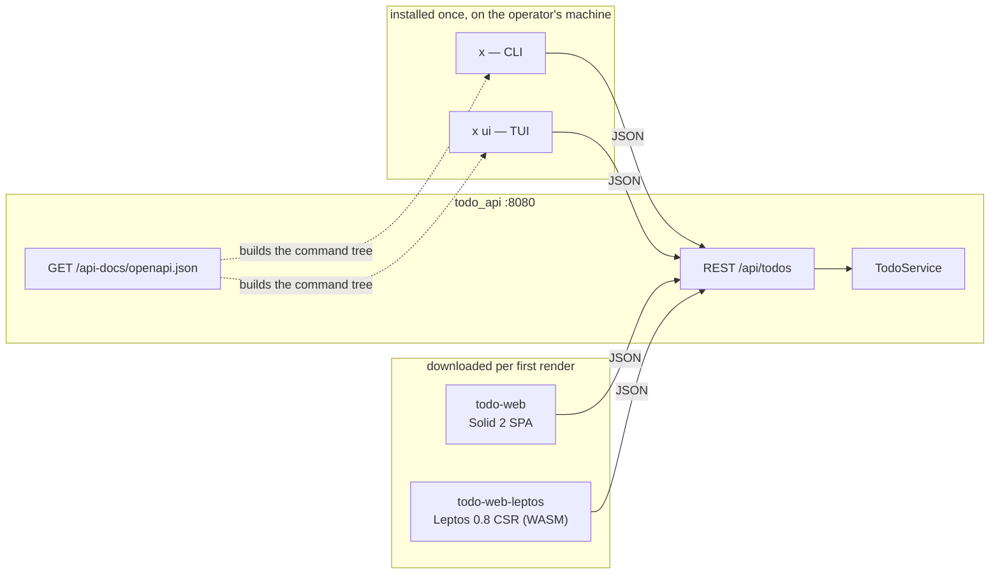

# One API, four delivery surfaces: what each one costs

`docs/todo-delivery-options.md` compares where *HTML* is produced. This
document compares something narrower and more decidable: **what a user's
machine has to download, hold in memory and send over the wire** to drive the
same `todo_api` through a CLI, a TUI, a JavaScript SPA, or a Rust/WASM SPA.

Everything below `todo_api` is identical across all four — same `TodoService`
(`libs/domains/todo`), same Postgres rows, same validation. The arrows into it
are what differ.



`x` and `x ui` are **one binary**. The TUI is a subcommand, not a second
artifact: it shares the registry, the transport and the renderer. An arm of a
benchmark that reimplements the data path measures the reimplementation.

## The options

| Option | Project | Command tree / UI comes from | Distribution | Reaches a new endpoint by |
|---|---|---|---|---|
| **CLI** | `apps/x/cli` · `x_cli`, bin `x` | The committed OpenAPI documents, parsed at run time | One static binary, installed once | Nothing — regenerate the document |
| **TUI** | same binary, `x ui` | same registry | same binary | Nothing — regenerate the document |
| **JS SPA** | `apps/todo/web` · `todo-web` | Hand-written Solid components | Downloaded per first render | Hand-writing a component + a fetch call |
| **WASM SPA** | `apps/todo/web-leptos` · `todo-web-leptos` | Hand-written Leptos components | Downloaded per first render | Hand-writing a component + a fetch call |

The two web arms are feature-equivalent to `todo-web`'s `/` route and nothing
more — same identity handling, same feature flags, same realtime feed, same
DOM and CSS. The parity checklist and the deliberate omissions (no router, no
nav — they exist only to switch between `/`, `/xstate` and `/effect`) are in
`apps/todo/web-leptos/README.md`. A byte comparison against a different feature
set is worthless, so that checklist is the load-bearing part of the arm.

## Measured

All numbers are from this repo, not vendor claims. Re-measure before quoting
them elsewhere:

```bash
task bench-assets   # scripts/bench/assets.sh — bytes, startup, RSS
task bench-ops      # scripts/bench/ops.sh   — bytes per operation
```

Until this change **no tool in this repo measured bytes**. Every kB figure in
`docs/todo-delivery-options.md`, `docs/todo-state-management.md` and the
`stack_profiles` table was measured by hand and transcribed, on *inconsistent
bases* — `stack_profiles` is raw uncompressed transfer, `todo-state-management`
is gzipped per-entry closure — so they could never be compared to each other.
The two scripts above are the fix, and the tables below are their output.

Environment for every number: 2026-09-20, Apple M4 Max · arm64 · 16 cores ·
Darwin 27.0.0. Compressors `Apple gzip 487.0.1 -9` and `brotli 1.2.0 -q 11`,
each file compressed on its own, because one file is one HTTP response.

### First render — what the browser downloads

Source: `task bench-assets`. The **first-render closure** is `index.html` plus
the `.js`/`.css`/`.wasm` it references, plus the `.wasm` named inside that JS.
Lazily imported route chunks are excluded.

| Arm | Files | Raw | gzip -9 | brotli -q 11 |
|---|---:|---:|---:|---:|
| `todo-web` · Solid 2 SPA | 4 | 156,591 | 53,985 | 48,526 |
| `todo-web-leptos` · Leptos CSR | 4 | 390,293 | 145,267 | 119,758 |
| **Leptos ÷ Solid** | | **2.49×** | **2.69×** | **2.47×** |

Per file:

| Arm | File | Kind | Raw | gzip -9 | brotli -q 11 |
|---|---|---|---:|---:|---:|
| Solid | `index.html` | html | 588 | 345 | 215 |
| Solid | `assets/index-*.js` | js | 80,326 | 26,717 | 24,056 |
| Solid | `assets/web-*.js` | js | 71,923 | 25,760 | 23,259 |
| Solid | `assets/index-*.css` | css | 3,754 | 1,163 | 996 |
| Leptos | `index.html` | html | 2,145 | 1,219 | 939 |
| Leptos | `todo-*.css` | css | 4,732 | 1,533 | 1,278 |
| Leptos | `todo_web_leptos-*.js` | js | 41,987 | 7,479 | 6,442 |
| Leptos | `todo_web_leptos-*_bg.wasm` | wasm | 341,429 | 135,036 | 111,099 |

Where the bytes go: the wasm module is 87% of the Leptos arm raw and 93%
gzipped. It is already `wasm-opt`-processed by trunk — the pre-`wasm-opt`
module is **1,450,691 bytes**, so the optimizer removes 76% and the honest
comparison only exists because trunk runs it.

**Brotli is not optional for the WASM arm.** It takes another 18% off the wasm
that gzip cannot (135,036 → 111,099), which moves the ratio from 2.69× to
2.47×. A raw-vs-gzip-only table flatters JS and penalizes WASM.

### Two basis traps

Both were hit while producing this table. They are the reason the numbers are
now scripted rather than transcribed.

1. **Summing the dist directory overstates first render by 2.6×.** `todo-web`'s
   `dist` is 9 files / 433,623 raw, but `/` pulls 4 files / 156,591. The rest
   (`xstate-route`, `effect-route`, `todo-view`, `decode`, `serverForms`) are
   lazy chunks. `AGENTS.md` records that `/` must never download the xstate or
   effect routes; that rule is what makes the difference this large.
2. **`gzip -9 -c FILE` and `gzip -9 -c < FILE` differ.** The first embeds the
   filename in the gzip header, so every hand-measured figure came out
   `len(filename)+1` bytes high. `scripts/bench/assets.sh` always feeds stdin.
   A small, plausible-looking, irreproducible discrepancy is exactly the class
   of error this exercise existed to remove.

### Binary arms — size, startup, memory

Source: `task bench-assets`, 10 runs, `min` quoted (wall times are
load-sensitive; bytes are not).

| Arm | Artifact | On disk | Invocation | Wall (min) | Peak RSS |
|---|---|---:|---|---:|---:|
| `x` · CLI **and** TUI | `dist/target/release/x` | 2,760,720 | `x --version` | 8.7 ms | 10,256,384 |
| `x` · CLI **and** TUI | ↳ same artifact | — | `x api list` | 8.5 ms | 10,289,152 |
| `todo_web_htmx` · axum SSR | `dist/target/release/todo_web_htmx` | 3,480,896 | n/a | — | — |

Three readings that matter:

- **`x --version` is not a no-op.** The clap command tree is built from the
  three embedded OpenAPI documents before clap can answer, so this row *is* the
  startup cost of being spec-driven. Against a load-matched `/bin/echo`
  (2.5 ms, 1,212,416 B RSS), that design costs ~3.3 ms and ~9 MB per
  invocation.
- **Doing real work is free by comparison.** `x api list` enumerates every
  operation of all three documents and formats them, and lands within noise of
  `--version`. Essentially all of the cost is startup, none of it is the work.
- **`todo_web_htmx` has no startup row on purpose.** `--version` never exits —
  an axum server ignores it and serves. Reporting a fabricated number there
  would be worse than the gap.

A binary is installed once. Its 2.8 MB is **not** comparable to a web arm's
first render, which is paid per cold browser cache. The comparable number is
the next table.

### Per-operation wire cost

Source: `task bench-ops`, median of 7 runs, against a list of **50** todos
(this row scales with the table, so it is only quotable with that count).

| Operation | Request bytes | Response bytes | Of which body | Status |
|---|---:|---:|---:|---:|
| `GET /api/todos` | 86 | 10,719 | 10,542 | 200 |
| `POST /api/todos` | 237 | 426 | 246 | 201 |
| `DELETE /api/todos/{id}` | 126 | 130 | 0 | 204 |

**`todo_api` does not negotiate compression.** Requesting
`Accept-Encoding: gzip` returns `identity`: the router in
`apps/todo/api/src/main.rs` is hand-built and carries no
`tower_http::CompressionLayer`, unlike the `create_router` path zerg and terran
use. On this 50-row list that is ~10.5 kB of JSON shipped uncompressed to every
client on every list request, browsers included. Recorded here as a finding,
not fixed by this change.

### Putting it together

A browser arm pays its first-render closure once per cold cache, then the same
per-operation bytes as the CLI. So the crossover is simply:

| | Solid SPA | Leptos WASM |
|---|---:|---:|
| First render (brotli) | 48,526 B | 119,758 B |
| Equivalent `GET /api/todos` calls (10,719 B each) | ~4.5 | ~11.2 |

For an operator running a handful of commands a day, the CLI ships zero
per-use bytes after install. For a user who keeps a tab open, first render is
amortised to nothing and the arms converge. The comparison only bites for
**cold-cache, low-interaction** use — which is exactly the remote-worker case
the CLI was built for.

## What each option is actually good at

| Concern | CLI (`x`) | TUI (`x ui`) | Solid SPA | Leptos WASM |
|---|---|---|---|---|
| New endpoint appears | Free — regenerate the document | Free | Hand-written | Hand-written |
| Scripting / piping | Native (`-o json` when piped) | No | No | No |
| Cold-start cost | 8.7 ms, once per command | 8.7 ms, once per session | First render, once per cold cache | First render, 2.5× the Solid arm |
| Memory | ~10 MB | ~10 MB | Browser tab | Browser tab + wasm linear memory |
| Reach | Anywhere with the binary and a URL | Same | Any browser | Any browser with WASM |
| Type safety of the client | Runtime, from the document | Runtime, from the document | Compile-time via ts-rs bindings | Compile-time, DTOs re-declared by hand |
| Offline / air-gapped | Documents are embedded; no checkout needed | Same | Needs a served bundle | Needs a served bundle |

The Leptos arm's weakest column is the last-but-one: it **cannot** depend on
`libs/domains/todo`, because that crate hard-depends on sea-orm, sqlx and axum,
so its DTOs are re-declared by hand (`apps/todo/web-leptos/src/dto.rs`). The
Solid arm has no such problem — it consumes the ts-rs bindings generated from
the very same Rust types. That is a real, structural argument against the WASM
arm in this repo that has nothing to do with bytes.

## Decision guide

- **Automating against the API, or working from a shell** → `x`. Zero bytes per
  use, and it gains endpoints for free.
- **Exploring what an API offers** → `x api list`, then `x ui`.
- **A browser UI for this workspace** → Solid. It is 2.5× smaller, and it shares
  DTOs with the server instead of re-declaring them.
- **A browser UI where the logic genuinely must be shared Rust** → Leptos, and
  only after extracting the DTOs into `libs/contracts/*` the way
  `contract_tasks` already is. Until then the WASM arm pays 2.5× the bytes for
  duplicated types, which is the worst of both.

## Serving a WASM arm

Measuring the Leptos arm surfaced two live defects in the shared web image, now
fixed (`manifests/dockers/`):

- nginx omitted `application/wasm` from `gzip_types` **and** omitted `wasm` from
  its long-lived-asset location, so the 341 kB module shipped uncompressed and
  revalidated on every load. After the fix: 341,429 → 135,626 bytes on the wire
  (nginx compresses at its default level 6; `gzip -9` would buy a further 590 B,
  0.4%, at CPU cost on every cache miss — not taken).
- caddy compressed it but never marked it immutable.

`static-web-server` was correct on both counts. `task test-web-servers
apps/todo/web-leptos/dist` is 27/27 across all three servers; the assertions
were not weakened to get there.

## Not done, on purpose

- **No precompressed `.br`/`.gz` artifacts.** It would make the WASM arm look
  better at the cost of a build step and a serving mode nothing else here uses.
  The brotli column already shows the ceiling.
- **No SSR/hydration Leptos arm.** `cargo-leptos` would add a second build
  driver and a server process; the question asked was what the *client*
  downloads.
- **No Lighthouse/CWV numbers.** Bytes and startup are decidable and stable;
  paint metrics on a dev machine are not.

## Tests and gates that defend this

| Gate | Guards |
|---|---|
| `task openapi-check` (in `verify`) | The documents `x` embeds still match the handler annotations |
| `document_satisfies_cli_invariants` (per API crate, `test-utils` feature `openapi`) | Path keys, unique operationIds, tags, declared `{id}` params — the five things the command tree derivation relies on |
| `nested_todo_routes_land_on_the_routes_axum_serves` | `utoipa`'s string-concat nesting does not publish `/todos/` for a route axum serves at `/todos` |
| `doc_endpoint_serves_the_document` | `--spec http://host/api-docs/openapi.json` builds the same tree as the embedded copy |
| `apps/x/cli` unit tests | Verb/resource derivation, arity dispatch, schema coercion, error-envelope rendering |
| `task test-web-servers DIST=<dist>` | Both dist layouts, including wasm MIME, compression and cache headers |
| `bun nx show project todo-web-leptos --json` | The excluded crate gets trunk targets, not `cargo build`, and no `rust` tag |
