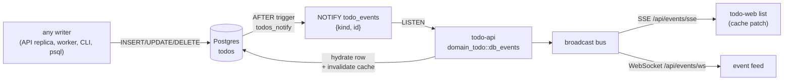

# Realtime UI: `todo-web` is the reference app

**`apps/todo/web` (nx project `todo-web`) is this repo's designated realtime
showcase.** It is the one UI whose list is driven by *database* change events
rather than by its own fetches, and it is where the pattern is meant to be read,
copied, and regression-tested. The other web apps (`todo-astro-web`,
`todo_web_htmx`, `zerg-web`, `terran-web`) deliberately stay request/response —
adding realtime to them is a decision, not a default.

## What "realtime DB update" means here

A committed change to the `todos` table appears in every open browser within one
round trip, **no matter which process made it**:

| Writer | Reaches the UI |
|---|---|
| `todo-web` itself (REST → todo-api) | ✅ |
| A second `todo-api` replica serving another user | ✅ |
| `todo-worker` / `todo-cli` | ✅ |
| A migration, a backfill script, `psql -c "UPDATE todos …"` | ✅ |

That last row is the point. The obvious implementation — have the API tee its own
mutations onto a channel — only ever shows changes made by *the process holding
your connection*. It looks identical in a single-replica demo and is wrong the
moment anything else writes. So the event source is the database.

## The path



1. **Trigger** — `manifests/db/todo/migrations/20260828133022_todo_notify.up.sql`
   defines `todo_notify()` and a row-level `AFTER INSERT OR UPDATE OR DELETE`
   trigger. It classifies the write into the same five kinds the service
   publishes (`created`, `updated`, `completed`, `uncompleted`, `deleted`), so a
   change made in SQL is indistinguishable from one made through the API.
2. **Listener** — `libs/domains/todo/src/db_events.rs` holds a dedicated
   connection (`sqlx::PgListener`), decodes the payload, and builds a `TodoEvent`.
3. **Fan-out** — `apps/todo/api/src/events.rs` owns a `tokio::broadcast` bus and
   serves it as SSE and WebSocket.
4. **UI** — `apps/todo/web/src/lib/realtime.ts` keeps one shared `EventSource`
   for the page and merges events into the TanStack Query cache;
   `apps/todo/web/src/todo-app.tsx` renders from that cache.

## Design decisions worth keeping

- **Payload is `{kind, id}`, not the row.** `NOTIFY` payloads are capped at 8000
  bytes and `todos.description` is unbounded `TEXT`, so shipping the row would
  fail on large values. The listener re-reads the row, which costs one indexed
  lookup and cannot truncate.
- **The re-read invalidates the cache first.** `todo-api` puts a NATS KV
  read-cache in front of Postgres. An external write leaves that cache stale, so
  `CachedTodoRepository::invalidate` runs before the hydrating read — the
  notification is the authoritative invalidation signal, and the snapshot that
  reaches the browser repopulates the cache.
- **`NOTIFY` is transactional.** It fires on `COMMIT`, so a rolled-back write is
  never shown. Covered by `a_rolled_back_change_is_never_published`.
- **The trigger is row-level.** One statement touching N rows produces N events.
  Covered by `batch_writes_produce_one_event_per_row`.
- **Reconnects refetch.** `NOTIFY` has no backlog: anything committed while a
  browser was disconnected is simply missed. The client therefore invalidates its
  list query on every (re)connect (`onOpen`), and event application is idempotent
  so the refetch and in-flight events cannot duplicate rows.
- **The service still publishes to NATS.** `TodoService` → JetStream (`todos.>`)
  is what `todo-worker` consumes; it is a separate concern from browser fan-out.
  The old in-process tee (`BroadcastTodoPublisher`) was removed rather than kept
  alongside the listener, which would have double-delivered every local mutation.

## Extending it to another table or app

1. Copy the trigger, changing the table and the kind classification. Keep the
   payload to identifiers.
2. Add a listener module next to the domain's repository; reuse
   `db_events::{subscribe, pump}` as the shape (subscribe first so callers can
   fail fast and tests can establish `LISTEN` before writing).
3. Feed the app's existing fan-out bus. Do not add a second event source for the
   same data.
4. If the domain has a read-cache, invalidate it in the listener.

## Tests that defend this

| Test | Guards |
|---|---|
| `libs/domains/todo/tests/db_events_it.rs` | The real path: raw SQL writes (never the repository) must arrive as the right events, with snapshots read from the DB. Rollbacks stay invisible; batches fan out per row. Postgres via testcontainers. |
| `libs/domains/todo/src/db_events.rs` (unit) | Payload decoding for all five kinds, malformed payloads rejected without panicking, deletes need no row read, a row deleted mid-flight degrades to `deleted`. |
| `apps/todo/web/src/lib/realtime.test.ts` | Cache-merge rules: ordering, in-place replacement, idempotency, unknown ids, missing snapshots, no input mutation. |
| `apps/todo/api/src/events.rs` (unit) | `/sse` content type and that a published event reaches the stream. |

## Running it

```bash
just docker-up            # Postgres + NATS
just migrate todo         # applies the trigger
just run todo-api         # or: cargo run -p todo_api
cd apps/todo/web && bun run dev
```

Then prove it end to end without touching the UI:

```bash
docker exec -i dockers-postgres-1 psql -U myuser -d todo \
  -c "INSERT INTO todos (id, title) VALUES (gen_random_uuid(), 'from psql');"
```

The row appears in the open browser immediately. Toggle `completed` on it in SQL
and the checkbox follows.
