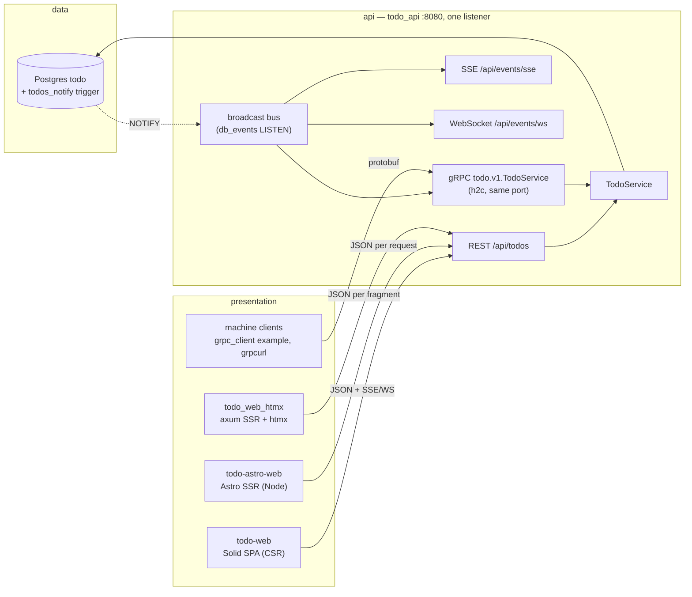

# One backend, every delivery option: the `todo` vertical

The `todo` vertical is the repo's three-tier reference: **one data tier**
(Postgres `todo`, migrations in `manifests/db/todo/migrations`), **one API
tier** (`apps/todo/api`, crate `todo_api`, the only process that owns a
connection to that database), and **several presentation tiers** that differ
only in *where HTML is produced and how the browser reaches the API*. Every
frontend and every machine client hits the same `TodoService`
(`libs/domains/todo`) over the same port, so the options can be compared on
equal footing — same rows, same validation, same events.



Everything below `todo_api` is shared. The rows compared in this document are
the arrows into it.

## The options

| Option | App / nx project | Where HTML is built | Browser ↔ API | Runtime + local port | Realtime |
|---|---|---|---|---|---|
| **Client-side rendered SPA** | `apps/todo/web` · `todo-web` | Browser (Solid) | JSON to `/api/todos` (vite proxy in dev, nginx `/api` proxy in the image) | static files, dev `:3100` | Yes: `EventSource` on `/api/events/sse` patches the TanStack Query cache; WebSocket demo in the event feed |
| **Server-side rendered, Node** | `apps/todo/web-astro` · `todo-astro-web` | Node per request (Astro `output: 'server'`) | Two variants on one server: `/solid` hydrates a Solid island that calls the same-origin `/api/todos` pass-through; `/htmx` swaps fragments from `/partials/*` | Node (`@astrojs/node` standalone), dev `:3200`, tilt `:5252` | No (request/response by design) |
| **Server-side rendered, Rust** | `apps/todo/web-htmx` · `todo_web_htmx` | axum per request/fragment (no JS runtime on the server) | htmx only: `/partials/todos*` return HTML built from todo-api JSON | single static binary, dev `:3300`, tilt `:5253` | No (request/response by design) |
| **Streaming** | part of `todo_api` | n/a | SSE, WebSocket, or gRPC server stream — same bus, three framings | `:8080` | This *is* the realtime option; see below |
| **gRPC** | part of `todo_api` (`src/grpc.rs`), contract `manifests/grpc/proto/apps/v1/todo.proto` | n/a (machine clients) | protobuf over h2c on the **same `:8080`** as REST | `:8080` | `Watch` server stream |

There is no separate gRPC binary and no separate streaming binary on purpose:
the point of the vertical is *one* backend. Adding a transport means adding a
route to `todo_api`, never a second process that reaches into the same tables
(`docs/adr-tasks-service-boundary.md` is the cautionary tale).

### Static HTML

`todo-astro-web`'s landing page (`/`) is the fourth, degenerate option: HTML +
CSS, zero interactivity, and the baseline the shipped-bytes numbers are measured
against. It also renders the live verdict from the `stack_profiles` table
(`GET /api/stacks`), so "which is cheapest" comes from the database, not from
this document.

## Measured

All numbers are from this repo, not vendor claims. Re-measure before quoting
them elsewhere.

### First render, per frontend

Source: `manifests/db/todo/migrations/20260827000000_stack_profiles.sql`,
measured against the production build of `todo-astro-web` (raw transfer,
uncompressed, 2026-08-27). Served live at `/api/stacks`, cheapest first.

| Stack | Client JS | Initial HTML | Subresource requests |
|---|---:|---:|---:|
| Static HTML | 0 kB | 6.8 kB | 0 |
| Solid island (`/solid`) | 26.3 kB | 8.3 kB | 5 |
| HTML + htmx (`/htmx`) | 58.9 kB | 5.0 kB | 1 |

The htmx row looks expensive because it is *uncompressed*: the vendored
`apps/todo/web-htmx/assets/htmx.min.js` is 51,238 bytes raw and 16,618 bytes
gzipped (measured 2026-09-02), and it is the only script — the app itself ships
zero JS. The island's 26.3 kB is bundled per page and grows with the app.

### The SPA, by route

Source: `apps/todo/web/README.md` / `docs/todo-state-management.md`
(gzipped, production build).

| Route | JS (gzip) |
|---|---:|
| `/` (TanStack Query + signals — the real app) | 46.2 kB |
| `/xstate` | +16.0 kB |
| `/effect` | +57.1 kB |

### Wire size, JSON vs protobuf

Measured 2026-09-02 by encoding the same todo (`title` 24 chars,
`description` 28 chars, priority high) with `serde_json` and `prost`
(`libs/rpc` generated types). SSE frame = `event: created\ndata: <json>\n\n`;
gRPC frame = message + the 5-byte length prefix. No compression on either side
(the API enables Zstd for gRPC and `compression-full` is available for HTTP,
so both shrink further on the wire).

| Payload | JSON (REST/SSE/WS) | protobuf (gRPC) | ratio |
|---|---:|---:|---:|
| One `Todo` | 247 B | 110 B | 2.2× |
| One `TodoEvent` (created, with snapshot) | 416 B (SSE frame 439 B) | 197 B (frame 202 B) | 2.1× |
| `List` of 50 todos | 12,401 B | 5,600 B | 2.2× |

Where the bytes go: JSON spends them on field names and RFC 3339 timestamps;
protobuf spends them on the 36-char UUID text this contract deliberately keeps
(so `grpcurl` output lines up with the JSON). Binary UUIDs (as `tasks.v1`
does) would take another ~40 B off each todo.

## What each option is actually good at

| Concern | Solid SPA (CSR) | Astro SSR + island | axum + htmx (SSR) | gRPC |
|---|---|---|---|---|
| Time to first paint | Empty shell → JS boots → fetch → render | Full list in the HTML; island hydrates after | Full list in the HTML; nothing to hydrate | n/a |
| Interaction after load | In-browser; optimistic UI is natural | Island: in-browser; htmx variant: one request per action | One request per action, server returns the new fragment | One RPC per action |
| Where state lives | Browser (query cache + signals) | Island: browser; htmx: the DOM | The DOM; server owns truth | Caller |
| Type safety across the wire | ts-rs DTOs (`@domain/todo`) generated from the Rust models | Same DTOs on the server side; HTML to the browser | Rust only; wire is HTML | Generated from the proto for both sides (`libs/rpc`) |
| Realtime | Built in (SSE cache patch; WS demo) | Would need an island + `EventSource` | Would need `hx-ext="sse"` | `Watch` server stream |
| Failure mode | Error boundary; shell survives | Page 503 with the disabled panel; island boundary | Non-2xx → no swap; last good DOM stays | Status code per RPC; stream ends with a status |
| Runtime you operate | nginx serving static files | Node process per replica | One Rust binary (~same as the API) | None extra — it is the API |
| Offline / flaky network | Fits | Island fits; htmx does not | Does not | Does not (h2 keep-alive helps) |
| Compression on the wire | HTTP gzip/br at the ingress | Same | Same | Zstd negotiated per call (`accept_compressed`) |
| Browser reach | Native | Native | Native | **Not from a browser** without grpc-web (not added — see below) |

### Streaming: three framings of one bus

All three read `apps/todo/api/src/events.rs`'s broadcast bus, which is fed by
the Postgres `todos_notify` trigger (`docs/realtime-todo.md`). A write from any
process — another replica, `todo-worker`, the CLI, `psql` — reaches every
subscriber on every framing.

| | SSE `/api/events/sse` | WebSocket `/api/events/ws` | gRPC `Watch` |
|---|---|---|---|
| Direction | Server → client | Both (the API echoes text frames as a demo) | Server → client (server streaming RPC) |
| Browser API | `EventSource`, auto-reconnect built in | `WebSocket`, reconnect is yours | None without grpc-web |
| Through proxies / ingress | Plain HTTP/1.1; needs buffering off (the `: connected` comment flushes headers) | Needs an Upgrade-aware proxy (`ws: true` in the vite proxy) | Needs end-to-end HTTP/2 |
| Message | Named event (`created`…`deleted`) + JSON | JSON text frame | `todo.v1.TodoEvent` |
| Slow consumer | `lagged` event with the drop count, stream continues | `lagged` text frame | `RESOURCE_EXHAUSTED` status with the drop count, stream ends |
| Backlog on reconnect | None — client re-`GET`s the list on `open` | None — same rule | None — client re-`List`s |

Pick SSE for browsers (it is what `todo-web` uses), WebSocket only when the
client must talk back on the same connection, and `Watch` for services and CLIs
that already speak gRPC.

## Decision guide

- **Content-first page, few interactions, SEO matters** → SSR. Astro if the
  team writes TypeScript and wants islands available; the axum + htmx binary if
  you want no Node in the runtime at all.
- **Interaction-heavy, client state, optimistic updates, realtime UI** → the
  Solid SPA. It is also the only frontend wired for live updates today.
- **Another service, a CLI, a worker** → gRPC on the same port. You get the
  generated client, ~2× smaller payloads, per-call Zstd, and the `Watch` stream
  without a browser-shaped API in the way.
- **Both a browser and a service need the same feature** → REST for the
  browser, gRPC for the service, one `TodoService` behind both. Do not add a
  BFF; the API already speaks both.

## Running it

```bash
just docker-up             # Postgres + NATS
just migrate todo          # schema, stack_profiles, the notify trigger
just run todo-api          # REST + SSE + WS + gRPC on :8080

cd apps/todo/web && bun run dev          # SPA        → http://localhost:3100
cd apps/todo/web-astro && bun run dev    # Astro SSR  → http://localhost:3200/{,solid,htmx}
cargo run -p todo_web_htmx               # axum+htmx  → http://localhost:3300 (TODO_WEB_HTMX_PORT)
```

gRPC, with the example client (create → complete → list → delete, then the
three `Watch` events the trigger produces):

```bash
cargo run -p todo_api --example grpc_client            # defaults to http://localhost:8080
```

Or with `grpcurl`. The server registers `grpc.health.v1.Health` but no
reflection service, so hand it the proto:

```bash
grpcurl -plaintext -import-path manifests/grpc/proto -proto apps/v1/todo.proto \
  localhost:8080 todo.v1.TodoService/List
grpcurl -plaintext -import-path manifests/grpc/proto -proto apps/v1/todo.proto \
  -d '{"title":"from grpcurl","priority":"PRIORITY_HIGH"}' \
  localhost:8080 todo.v1.TodoService/Create
grpcurl -plaintext -import-path manifests/grpc/proto -proto apps/v1/todo.proto \
  localhost:8080 todo.v1.TodoService/Watch          # then write from any client
grpcurl -plaintext localhost:8080 grpc.health.v1.Health/Check \
  -d '{"service":"todo.v1.TodoService"}'
```

Prove the "any writer" claim without a client at all:

```bash
docker exec -i dockers-postgres-1 psql -U myuser -d todo \
  -c "INSERT INTO todos (id, title) VALUES (gen_random_uuid(), 'from psql');"
```

The row appears in the SPA, on the SSE stream, and on every open `Watch`.

## How gRPC shares the port

`apps/todo/api/src/grpc.rs` builds the tonic service, wraps it in
`tonic::service::Routes` and merges the resulting `axum::Router` into the HTTP
app. Three details are load-bearing:

1. **`axum::serve` speaks h2c.** hyper-util's auto builder accepts HTTP/1.1
   and HTTP/2 prior-knowledge on one listener, which is all tonic needs. No
   TLS, no second port, no change to `butler.toml` — the k8s Service, probes
   and Tilt forward are the ones REST already had.
2. **Start from `Routes::from(axum::Router::new())`, not `Routes::default()`.**
   The default carries an `UNIMPLEMENTED` fallback; merging that over the REST
   routes would swallow every unknown HTTP path with a gRPC status.
3. **Merge after the HTTP layers.** CORS and `TraceLayer::new_for_http` wrap
   `/api/*` only; a CORS preflight has no meaning for gRPC and tonic's status
   codes must not be reshaped.

Errors map the way the REST layer maps `TodoError` to HTTP: `NotFound` →
`NOT_FOUND`, `Validation` → `INVALID_ARGUMENT`, everything else `INTERNAL`
with the database detail logged, not returned.

### Not done, on purpose

- **No grpc-web / browser gRPC.** It needs `tonic-web` (or Envoy) in front and
  a generated TS client; the browser options above already cover the browser.
  Add it only if a browser needs the `Watch` stream *and* SSE is ruled out.
- **No reflection service.** `grpcurl -proto` works; reflection adds a
  dependency to answer a question the checked-in proto already answers.
- **No auth.** `todo_api` has none on REST either; this vertical demonstrates
  delivery, not tenancy. `apps/zerg/tasks` is the authenticated gRPC example.

## Tests that defend this

| Test | Guards |
|---|---|
| `apps/todo/e2e` (Playwright, `just e2e`) | The whole table above, in a browser: the same CRUD loop on all four surfaces through one page object; SSR pages carry the list in the initial HTML and the SPA shell does not; a `psql` write reaches the open SPA over SSE; an htmx write reaches the SPA in another tab; the `grpc_client` example runs against the listener the browser is using; the landing page renders the DB-backed `stack_profiles` |
| `apps/todo/api/src/grpc.rs` `crud_round_trip_over_grpc_is_visible_over_rest` | REST and gRPC served from one `axum::serve` on one ephemeral port; a gRPC write is read back over HTTP/1.1 REST |
| `…` `watch_streams_bus_events` | An event on the shared bus arrives as a `todo.v1.TodoEvent` |
| `…` `domain_validation_maps_to_invalid_argument` | Domain validation and bad UUIDs surface as `INVALID_ARGUMENT`, not `INTERNAL` |
| `…` `health_reports_service_serving` | `grpc.health.v1.Health` answers `SERVING` for `todo.v1.TodoService` |
| `apps/todo/api/src/events.rs` | SSE content type and delivery |
| `libs/domains/todo/tests/db_events_it.rs` | The trigger → LISTEN path all three streams depend on |
| `apps/todo/web/src/lib/realtime.test.ts` | The SPA's cache-merge rules |
| `apps/todo/web-astro/src/lib/fragments.test.ts` | The SSR fragment contract the htmx variants render |
